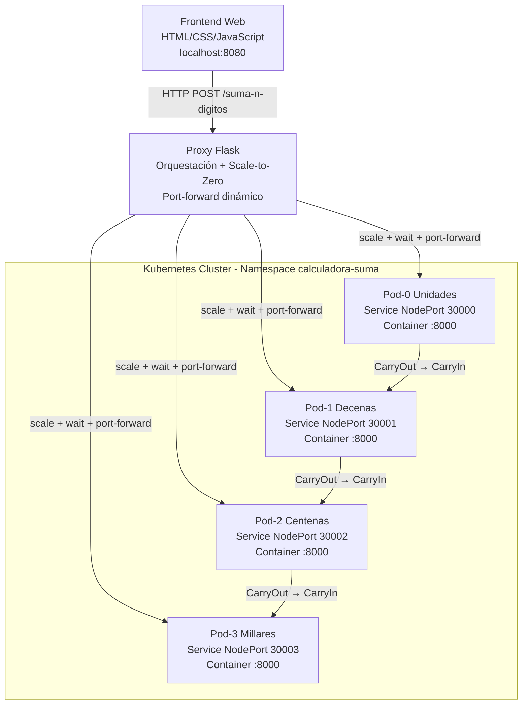

# Calculadora con Kubernetes y N-Dígitos

Aplicación web que suma números de hasta 4 dígitos (0-9999) usando **Kubernetes** para orquestar múltiples pods en cascada, simulando un sumador de circuitos digitales (Ripple-Carry Adder).

[TOC]

## Rama: NDigitos

Esta rama implementa la suma de números de N dígitos (1-4) mediante la orquestación dinámica de pods en Kubernetes:

- **Pod 0 (Unidades)**: NodePort 30000
- **Pod 1 (Decenas)**: NodePort 30001
- **Pod 2 (Centenas)**: NodePort 30002
- **Pod 3 (Millares)**: NodePort 30003

El **CarryOut** de cada pod se conecta automáticamente al **CarryIn** del siguiente pod en la cascada.

## Rama: DigitosDinamicos (ACTUAL)

Esta rama extiende **NDigitos** implementando **escalado dinámico de pods** (scale-to-zero):

### Características del Escalado Dinámico

- **Estado inicial**: Todos los deployments tienen `replicas: 0` (sin pods corriendo)
- **Escalado bajo demanda**: Los pods se escalan automáticamente según los dígitos necesarios
- **Optimización de recursos**: Solo se activan los pods necesarios para cada operación:
  - `5 + 3` → Solo escala Pod-0 (Unidades)
  - `99 + 88` → Escala Pod-0 y Pod-1 (Unidades + Decenas)
  - `9876 + 5432` → Escala los 4 pods (Unidades + Decenas + Centenas + Millares)
- **Port-forwarding dinámico**: El proxy Flask establece automáticamente los port-forwards necesarios

### Ventajas

- **Ahorro de recursos**: 0 MB de RAM en reposo vs. 256 MB con 4 pods siempre activos
- **Escalado horizontal**: Solo paga por lo que usa
- **Latencia aceptable**: ~10-15 segundos para el primer request (tiempo de arranque del pod), <1 segundo para subsecuentes
- **Ideal para cargas intermitentes**: Calculadora de uso ocasional

### Flujo de Escalado

1. Usuario solicita: `9876 + 5432`
2. Proxy detecta que necesita 4 dígitos
3. Escala dinámicamente: `kubectl scale deployment suma-digito-{0,1,2,3} --replicas=1`
4. Espera a que los pods estén `Ready` (kubectl wait)
5. Establece port-forwards para cada pod
6. Ejecuta la suma en cascada
7. Retorna el resultado

## Arquitectura del Sistema



### Componentes

- **Frontend**: HTML/CSS/JavaScript (Puerto 8080)
- **Proxy Flask**: Orquesta las llamadas a los servicios K8s y gestiona el escalado dinámico
- **Pods Kubernetes**: 4 pods idénticos del backend (ghcr.io/lhalha01/contenedores-backend:latest)
  - **Escalado dinámico**: Los pods inician en `replicas: 0` y se escalan bajo demanda
  - **Port-forwarding automático**: El proxy establece los port-forwards cuando se necesitan
- **Servicios NodePort**: Exponen cada pod en puertos 30000-30003

### Flujo de Datos (Ejemplo: 9876 + 5432)

1. Usuario ingresa: `A=9876`, `B=5432`
2. Proxy descompone en dígitos (derecha a izquierda):

  ```text
   Posición  | A | B |
   ---------|---|---|
   0 (Unid) | 6 | 2 |
   1 (Dec)  | 7 | 3 |
   2 (Cent) | 8 | 4 |
   3 (Mill) | 9 | 5 |
   ```

1. **Pod-0 (Unidades)**:
   - Input: `6 + 2 + 0(CarryIn)` = 8
   - Output: `Result=8, CarryOut=0` ✓
   
1. **Pod-1 (Decenas)**:
   - Input: `7 + 3 + 0(CarryIn previo)` = 10
   - Output: `Result=0, CarryOut=1` ✓
   
1. **Pod-2 (Centenas)**:
   - Input: `8 + 4 + 1(CarryIn previo)` = 13
   - Output: `Result=3, CarryOut=1` ✓
   
1. **Pod-3 (Millares)**:
   - Input: `9 + 5 + 1(CarryIn previo)` = 15
   - Output: `Result=5, CarryOut=1` ✓

1. **Resultado final**: `[CarryOut][M][C][D][U]` = `15308` ✓

## Requisitos

- **Kubernetes**: Minikube, Podman Desktop, o cualquier cluster local
- **kubectl**: Para gestionar recursos de K8s
- **Helm 3**: Para desplegar el chart `helm/suma-basica`
- **Python 3.x**: Con Flask, Flask-CORS y Requests
- **Podman Desktop** (recomendado para Windows): Incluye Kubernetes integrado

## Instalación

### Paso 1: Instalar Podman Desktop (Windows)

```powershell
winget install RedHat.Podman-Desktop
```

### Paso 2: Habilitar Kubernetes en Podman Desktop

1. Abrir **Podman Desktop**
2. Ir a **Settings** → **Kubernetes**
3. Activar **Enable Kubernetes**
4. Esperar a que el cluster esté **Running** ✓

### Paso 3: Verificar Kubernetes

```powershell
kubectl cluster-info
kubectl get nodes
```

Deberías ver un nodo en estado **Ready**.

### Paso 3.1: Arrancar Podman y Minikube (si el cluster está apagado)

Si ves errores como `Unable to connect to the server` o `PROVIDER_PODMAN_NOT_RUNNING`, inicia primero Podman y luego Minikube:

```powershell
# 1) Verificar máquinas de Podman
podman machine list

# 2) Iniciar la máquina por defecto (si está detenida)
podman machine start podman-machine-default

# 3) Iniciar Minikube usando driver Podman
minikube start --driver=podman

# 4) Verificar contexto y estado
kubectl config current-context
kubectl get nodes
kubectl get deployments -n calculadora-suma
```

Para parar el entorno al terminar:

```powershell
minikube stop
podman machine stop podman-machine-default
```

### Paso 4: Instalar Dependencias Python

```powershell
pip install flask flask-cors requests
```

### Paso 5: Instalar Helm (Windows)

```powershell
winget install Helm.Helm
```

Verifica que Helm quedó disponible:

```powershell
helm version
```

## Despliegue en Kubernetes

### Validación rápida del chart Helm

```powershell
helm lint ./helm/suma-basica
helm template suma-basica ./helm/suma-basica | Select-Object -First 40 | Out-String
```

### 1. Crear Secret para GitHub Container Registry

Para descargar la imagen privada del backend, necesitas autenticarte:

```powershell
kubectl create secret docker-registry ghcr-secret \
  --docker-server=ghcr.io \
  --docker-username=lhalha01 \
  --docker-password=<TU_GITHUB_PAT> \
  -n calculadora-suma
```

**Nota**: Reemplaza `<TU_GITHUB_PAT>` con tu Personal Access Token de GitHub con permisos `read:packages`.

### 2. Desplegar con Helm (recomendado)

```powershell
# Instalar/actualizar release
helm upgrade --install suma-basica ./helm/suma-basica \
  --namespace calculadora-suma \
  --create-namespace

# Verificar recursos
kubectl get all -n calculadora-suma
```

Para personalizar puertos, imagen o réplicas iniciales, ajusta `helm/suma-basica/values.yaml`.

#### Comando único (local Minikube/Podman)

Define primero tu PAT de GitHub en la sesión:

```powershell
$env:GITHUB_PAT="<TU_GITHUB_PAT>"
```

Después ejecuta este comando único (idempotente):

```powershell
kubectl create namespace calculadora-suma --dry-run=client -o yaml | kubectl apply -f -; kubectl create secret docker-registry ghcr-secret --docker-server=ghcr.io --docker-username=lhalha01 --docker-password=$env:GITHUB_PAT -n calculadora-suma --dry-run=client -o yaml | kubectl apply -f -; helm upgrade --install suma-basica ./helm/suma-basica --namespace calculadora-suma --create-namespace -f ./helm/suma-basica/values-local.yaml
```

### 3. Aplicar Manifiestos de Kubernetes (alternativa)

```powershell
# Crear namespace
kubectl apply -f k8s/namespace.yaml

# Desplegar pods y servicios
kubectl apply -f k8s/deployment.yaml

# Verificar que los pods estén Running
kubectl get pods -n calculadora-suma
```

### 4. Port-Forward de Servicios (Automático)

**Rama DigitosDinamicos**: El proxy Flask establece automáticamente los port-forwards necesarios cuando escala los pods. No es necesario ejecutar comandos de port-forward manualmente.

**Nota**: Si deseas verificar manualmente los servicios o usar la rama NDigitos (sin escalado dinámico), puedes establecer port-forwards manualmente:

```powershell
# Terminal 1
kubectl port-forward -n calculadora-suma service/suma-digito-0 30000:8000

# Terminal 2
kubectl port-forward -n calculadora-suma service/suma-digito-1 30001:8000

# Terminal 3
kubectl port-forward -n calculadora-suma service/suma-digito-2 30002:8000

# Terminal 4
kubectl port-forward -n calculadora-suma service/suma-digito-3 30003:8000
```

En la rama **DigitosDinamicos**, el proxy gestiona esto automáticamente.

**Tip para rama NDigitos**: Puedes usar un script PowerShell para iniciar todos los port-forwards en background:

```powershell
Start-Job -ScriptBlock { kubectl port-forward -n calculadora-suma service/suma-digito-0 30000:8000 }
Start-Job -ScriptBlock { kubectl port-forward -n calculadora-suma service/suma-digito-1 30001:8000 }
Start-Job -ScriptBlock { kubectl port-forward -n calculadora-suma service/suma-digito-2 30002:8000 }
Start-Job -ScriptBlock { kubectl port-forward -n calculadora-suma service/suma-digito-3 30003:8000 }
```

### 5. Iniciar el Proxy Flask

```powershell
python proxy.py
```

### 6. Abrir la Aplicación

Navega a: **<http://localhost:8080>**

## Estructura de Archivos

```text
SumaBasicaDocker/
├── helm/
│   └── suma-basica/        # Chart Helm del backend distribuido por dígitos
│       └── values-local.yaml # Overrides para despliegue local con Helm
├── k8s/
│   ├── namespace.yaml      # Definición del namespace
│   └── deployment.yaml     # 4 Deployments + Services (NodePort)
├── scripts/
│   ├── helm-local.ps1      # Validación + despliegue Helm local
│   ├── helm-status.ps1     # Diagnóstico de release/pods/eventos
│   ├── helm-clean.ps1      # Limpieza de release/namespace/secret
│   └── helm-all.ps1        # Flujo completo (deploy + diagnóstico)
├── index.html              # Frontend con visualización dinámica de pods
├── script.js               # Lógica JavaScript (llama a /suma-n-digitos)
├── styles.css              # Estilos CSS con tema Kubernetes
├── proxy.py                # API Flask y coordinación de operación
├── k8s_orchestrator.py     # Orquestación Kubernetes desacoplada
└── README.md               # Este archivo
```

## Comandos Útiles de Kubernetes

### Ver Recursos

```powershell
# Ver todos los recursos en el namespace
kubectl get all -n calculadora-suma

# Ver logs de un pod específico
kubectl logs -n calculadora-suma <nombre-pod>

# Describir un pod (útil para debugging)
kubectl describe pod -n calculadora-suma <nombre-pod>

# Ver servicios y sus puertos
kubectl get services -n calculadora-suma
```

### Escalar Pods

**Rama DigitosDinamicos**: El escalado se realiza automáticamente. Los deployments inician en `replicas: 0` y el proxy los escala bajo demanda.

Para escalar manualmente (rama NDigitos o debugging):

```powershell
# Aumentar réplicas de un deployment
kubectl scale deployment suma-digito-0 --replicas=3 -n calculadora-suma

# Verificar réplicas
kubectl get deployments -n calculadora-suma

# Escalar todos los deployments a 0 (rama DigitosDinamicos por defecto)
kubectl scale deployment suma-digito-0 suma-digito-1 suma-digito-2 suma-digito-3 --replicas=0 -n calculadora-suma

# Escalar todos los deployments a 1 (rama NDigitos comportamiento original)
kubectl scale deployment suma-digito-0 suma-digito-1 suma-digito-2 suma-digito-3 --replicas=1 -n calculadora-suma
```

### Limpiar Recursos

```powershell
# Eliminar todo el namespace (y sus recursos)
kubectl delete namespace calculadora-suma

# O eliminar release de Helm
helm uninstall suma-basica -n calculadora-suma

# O eliminar recursos individuales
kubectl delete -f k8s/deployment.yaml
kubectl delete -f k8s/namespace.yaml
```

### Reiniciar Pods

```powershell
# Reiniciar todos los pods de un deployment
kubectl rollout restart deployment suma-digito-0 -n calculadora-suma

# Verificar el estado del rollout
kubectl rollout status deployment suma-digito-0 -n calculadora-suma
```

## Helm Cheatsheet

Script recomendado para local (valida + despliega en un paso):

```powershell
$env:GITHUB_PAT="<TU_GITHUB_PAT>"
./scripts/helm-local.ps1
```

Solo validación del chart (sin desplegar):

```powershell
./scripts/helm-local.ps1 -ValidateOnly
```

Limpieza rápida de recursos Helm:

```powershell
# Solo desinstalar release (conserva namespace y secret)
./scripts/helm-clean.ps1

# Desinstalar release y eliminar namespace + secret
./scripts/helm-clean.ps1 -DeleteNamespace -DeleteGhcrSecret
```

Diagnóstico rápido de release/pods/eventos:

```powershell
./scripts/helm-status.ps1
./scripts/helm-status.ps1 -EventsTail 50
```

Flujo completo (deploy + diagnóstico):

```powershell
$env:GITHUB_PAT="<TU_GITHUB_PAT>"
./scripts/helm-all.ps1

# Solo validar chart + estado (sin desplegar)
./scripts/helm-all.ps1 -ValidateOnly
```

```powershell
# Instalar/actualizar release
helm upgrade --install suma-basica ./helm/suma-basica --namespace calculadora-suma --create-namespace -f ./helm/suma-basica/values-local.yaml

# Ver valores efectivos y estado
helm get values suma-basica -n calculadora-suma
helm status suma-basica -n calculadora-suma

# Ver historial y rollback
helm history suma-basica -n calculadora-suma
helm rollback suma-basica 1 -n calculadora-suma

# Desinstalar release
helm uninstall suma-basica -n calculadora-suma
```

### Diagnóstico rápido Helm

```powershell
# 1) Verificar binario Helm en PATH
helm version

# 2) Revisar render del chart sin desplegar
helm lint ./helm/suma-basica
helm template suma-basica ./helm/suma-basica | Select-Object -First 60 | Out-String

# 3) Revisar estado de la release y eventos del namespace
helm status suma-basica -n calculadora-suma
kubectl get events -n calculadora-suma --sort-by=.metadata.creationTimestamp | Select-Object -Last 30

# 4) Si hay ImagePullBackOff, validar secret e imagen
kubectl get secret ghcr-secret -n calculadora-suma
kubectl describe pod -n calculadora-suma -l app=suma-backend
```

## API del Proxy

### Endpoint Principal

**POST** `/suma-n-digitos`

**Request:**

```json
{
  "NumberA": 9876,
  "NumberB": 5432
}
```

**Response:**

```json
{
  "Result": 15308,
  "CarryOut": 1,
  "NumDigitos": 4,
  "ContenedoresUsados": 4,
  "Details": [
    {
      "Posicion": 0,
      "NombrePosicion": "Unidades",
      "Pod": "suma-digito-0",
      "Port": 30000,
      "A": 6, "B": 2, "CarryIn": 0,
      "Result": 8, "CarryOut": 0
    },
    {
      "Posicion": 1,
      "NombrePosicion": "Decenas",
      "Pod": "suma-digito-1",
      "Port": 30001,
      "A": 7, "B": 3, "CarryIn": 0,
      "Result": 0, "CarryOut": 1
    },
    {
      "Posicion": 2,
      "NombrePosicion": "Centenas",
      "Pod": "suma-digito-2",
      "Port": 30002,
      "A": 8, "B": 4, "CarryIn": 1,
      "Result": 3, "CarryOut": 1
    },
    {
      "Posicion": 3,
      "NombrePosicion": "Millares",
      "Pod": "suma-digito-3",
      "Port": 30003,
      "A": 9, "B": 5, "CarryIn": 1,
      "Result": 5, "CarryOut": 1
    }
  ]
}
```

## Ejemplos de Prueba

### Ejemplo 1: Números de 1 dígito (usa solo Pod-0)

```text
5 + 3 = 8
- Pod-0 (Unidades): 5+3+0=8 → Result=8, CarryOut=0
- Resultado: 8
- Pods usados: 1
```

### Ejemplo 2: Números de 2 dígitos con carry

```text
99 + 88 = 187
- Pod-0 (Unidades): 9+8+0=17 → Result=7, CarryOut=1
- Pod-1 (Decenas): 9+8+1=18 → Result=8, CarryOut=1
- Resultado: 187 (concatena: 1+8+7)
- Pods usados: 2
```

### Ejemplo 3: Números de 4 dígitos

```text
9876 + 5432 = 15308
- Pod-0: 6+2+0=8 → Result=8, CarryOut=0
- Pod-1: 7+3+0=10 → Result=0, CarryOut=1
- Pod-2: 8+4+1=13 → Result=3, CarryOut=1
- Pod-3: 9+5+1=15 → Result=5, CarryOut=1
- Resultado: 15308 (concatena: 1+5+3+0+8)
- Pods usados: 4
```

### Ejemplo 4: Máximo valor soportado

```text
9999 + 9999 = 19998
- Pod-0: 9+9+0=18 → Result=8, CarryOut=1
- Pod-1: 9+9+1=19 → Result=9, CarryOut=1
- Pod-2: 9+9+1=19 → Result=9, CarryOut=1
- Pod-3: 9+9+1=19 → Result=9, CarryOut=1
- Resultado: 19998
- Pods usados: 4
```

## Pruebas con API

### Probar un pod individual (con port-forward activo)

```powershell
$body = @{NumberA=5; NumberB=3; CarryIn=0} | ConvertTo-Json
Invoke-WebRequest -Uri "http://localhost:30000/suma" -Method POST -Body $body -ContentType "application/json" -UseBasicParsing
```

### Probar la cascada completa

```powershell
$body = @{NumberA=9876; NumberB=5432} | ConvertTo-Json
Invoke-WebRequest -Uri "http://localhost:8080/suma-n-digitos" -Method POST -Body $body -ContentType "application/json" -UseBasicParsing
```

## Características del Frontend

- **Entradas**: Números de 0 a 9999
- **Visualización dinámica**:
  - Solo muestra los pods realmente usados (1-4)
  - Resalta el CarryOut cuando está activo (rojo con animación)
  - Muestra el flujo de carry entre pods
  - Iconos de Kubernetes (pods, servicios)
- **Responsive**: Se adapta a móviles y tablets
- **Tema**: Colores azul/morado estilo Kubernetes

## Ramas del Proyecto

Este proyecto tiene 3 ramas con diferentes niveles de complejidad:

### Política de ramas operativas

- `DigitosDinamicos` y `ConHelm` se mantienen como versiones operativas distintas.
- No se realiza merge entre ambas ramas para preservar escenarios de operación diferentes.
- Los cambios deben aplicarse de forma intencional en la rama objetivo correspondiente.

### `master` - Un Dígito (0-9)

- 1 contenedor Podman
- Puerto: 8000
- Ideal para aprender lo básico

### `DosDigitos` - Dos Dígitos (0-99)

- 2 contenedores Podman en cascada
- Puertos: 8001, 8002
- Introduce el concepto de carry entre contenedores

### `NDigitos` (actual) - N Dígitos (0-9999)

- 4 pods Kubernetes con NodePort
- Puertos: 30000-30003
- Orquestación dinámica según dígitos necesarios
- Arquitectura cloud-native escalable

## URLs del Sistema

- **Frontend**: <http://localhost:8080>
- **API Proxy**: <http://localhost:8080/suma-n-digitos>
- **Pod-0 (Unidades)**: <http://localhost:30000/suma>
- **Pod-1 (Decenas)**: <http://localhost:30001/suma>
- **Pod-2 (Centenas)**: <http://localhost:30002/suma>
- **Pod-3 (Millares)**: <http://localhost:30003/suma>
- **Docs API Backend**: <http://localhost:30000/docs>

## Solución de Problemas

### Pods en ImagePullBackOff

```powershell
# Verificar el secret
kubectl get secret ghcr-secret -n calculadora-suma

# Si no existe, créalo como se indica en la sección de despliegue
kubectl create secret docker-registry ghcr-secret ...
```

### Port-forward no funciona

```powershell
# Verificar que los pods estén Running
kubectl get pods -n calculadora-suma

# Reiniciar los port-forwards
Get-Job | Remove-Job -Force
kubectl port-forward -n calculadora-suma service/suma-digito-0 30000:8000
# ... repetir para los otros 3 servicios
```

### Proxy no se conecta a los servicios

```powershell
# Verificar que los servicios existan
kubectl get services -n calculadora-suma

# Probar un servicio individualmente
Invoke-WebRequest -Uri "http://localhost:30000/suma" -Method POST ...
```

---

**Rama:** NDigitos  
**Tecnologías**: Kubernetes, Podman Desktop, Flask, Python  
**Versión:** 3.0  
**Fecha:** Febrero 2026  
**Repositorio**: <https://github.com/lhalha01/SumaBasicaDocker>
