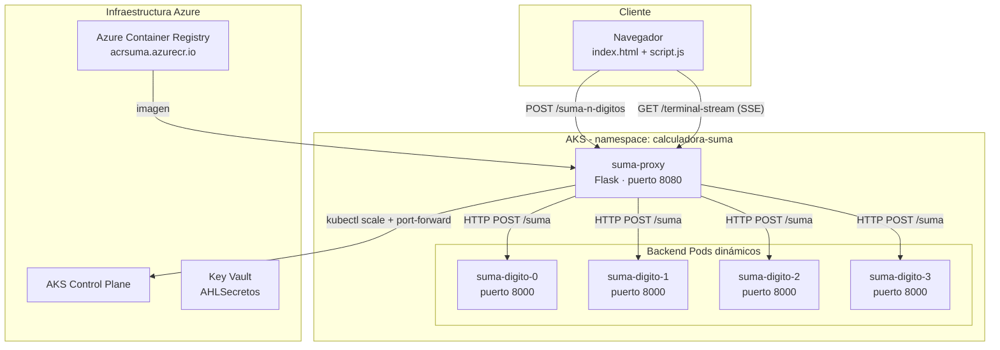
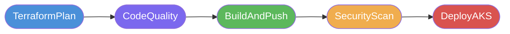

# SumaBasicaDocker

Calculadora distribuida que descompone una suma de hasta 4 dígitos en operaciones independientes, cada una ejecutada por un microservicio Python dedicado orquestado en Kubernetes. El proxy frontend escala dinámicamente los pods necesarios según los dígitos del número introducido.

---

## Índice

- [Arquitectura](#arquitectura)
- [Estructura del repositorio](#estructura-del-repositorio)
- [Componentes](#componentes)
- [Flujo de una petición](#flujo-de-una-petición)
- [Pipeline CI/CD](#pipeline-cicd)
- [Variables de entorno](#variables-de-entorno)
- [Ejecución local](#ejecución-local)
- [Despliegue en AKS](#despliegue-en-aks)
- [Seguridad](#seguridad)
- [Calidad de código](#calidad-de-código)

---

## Arquitectura



---

## Estructura del repositorio

```
SumaBasicaDocker/
├── proxy.py                  # Servidor Flask principal (orquestador + API)
├── k8s_orchestrator.py       # Clase que interactúa con kubectl
├── index.html                # UI de la calculadora
├── script.js                 # Lógica frontend
├── styles.css                # Estilos
├── requirements.txt          # Dependencias Python
├── Dockerfile                # Imagen Docker del proxy
├── azure-pipelines.yml       # Pipeline CI/CD completa
├── k8s/
│   ├── namespace.yaml            # Namespace calculadora-suma
│   ├── backend-workloads.yaml    # 4 Deployments + 4 Services (suma-digito-0..3)
│   ├── proxy-deployment.yaml     # Deployment del proxy
│   ├── proxy-service.yaml        # Service LoadBalancer del proxy
│   ├── proxy-rbac.yaml           # ServiceAccount + ClusterRoleBinding
│   └── ghcr-secret-example.yaml  # Ejemplo de secret para GHCR
└── infra/
    └── terraform/
        ├── main.tf               # Recursos Azure (AKS, ACR, role assignments)
        ├── variables.tf
        ├── outputs.tf
        ├── providers.tf
        └── terraform.tfvars.example
```

---

## Componentes

### `proxy.py` — Proxy orquestador

Servidor Flask que actúa como punto de entrada único. Sus responsabilidades:

- Recibe la petición de suma e identifica cuántos dígitos tiene cada número
- **Escala dinámicamente** los pods `suma-digito-{n}` necesarios vía `K8sOrchestrator`
- Espera a que los pods estén `Ready` antes de enviarles peticiones
- Realiza las llamadas HTTP en paralelo a cada microservicio backend
- Agrega los resultados parciales y devuelve la suma total
- Expone un stream SSE (`/terminal-stream`) con los logs en tiempo real para el terminal embebido en la UI
- Auto-escala a 0 réplicas tras `SCALE_DOWN_DELAY_SECONDS` segundos de inactividad

### `k8s_orchestrator.py` — Orquestador Kubernetes

Clase `K8sOrchestrator` que abstrae las operaciones `kubectl`:

| Método | Operación kubectl |
|---|---|
| `escalar_pod(digito, replicas)` | `kubectl scale deployment suma-digito-N` |
| `esperar_pod_ready(digito)` | `kubectl wait --for=condition=ready` |
| `iniciar_port_forward(digito)` | `kubectl port-forward` (solo modo local) |
| `liberar_recursos()` | Termina procesos port-forward activos |

> En modo `ORCHESTRATOR_IN_CLUSTER=true` (AKS) no usa port-forward sino DNS interno del cluster.

### Backend microservicios (`suma-digito-0..3`)

Cada uno es un servicio Python mínimo escuchando en puerto `8000` que acepta `POST /suma` con `{"digito": N, "numero": X}` y responde con la suma parcial del dígito correspondiente.

---

## Flujo de una petición


---

## Pipeline CI/CD



| Stage | Descripción |
|---|---|
| **TerraformPlan** | `terraform init/validate/plan` sobre `infra/terraform/` |
| **CodeQuality** | Análisis estático con SonarCloud Scanner CLI 6.2.1 |
| **BuildAndPush** | `docker build` + push a ACR (`acrsuma.azurecr.io/suma-proxy`) |
| **SecurityScan** | Trivy: escaneo de CVEs en imagen + misconfiguraciones en IaC |
| **DeployAKS** | `kubectl apply` de todos los manifiestos K8s en AKS |

### Variables de la pipeline

| Variable | Valor por defecto | Tipo |
|---|---|---|
| `azureServiceConnection` | `LabsConn` | Pública |
| `trivyImageFailSeverities` | `CRITICAL` | Pública |
| `trivyConfigFailSeverities` | `HIGH,CRITICAL` | Pública |
| `sonarOrganization` | `lhalha01` | Pública |
| `sonarProjectKey` | `lhalha01_SumaBasicaDocker` | Pública |
| `SONAR_TOKEN` | — | **Secreta** |
| `ghcrPat` | — | **Secreta** (o Key Vault) |
| `AKS_KUBELET_OBJECT_ID` | — | Secreta |

---

## Variables de entorno

| Variable | Descripción | Por defecto |
|---|---|---|
| `K8S_NAMESPACE` | Namespace de Kubernetes | `calculadora-suma` |
| `ORCHESTRATOR_IN_CLUSTER` | `true` en AKS, `false` en local | `true` |
| `ORCHESTRATOR_BASE_PORT` | Puerto base para port-forward local | `31000` |
| `BACKEND_SERVICE_PORT` | Puerto de los servicios backend | `8000` |

---

## Ejecución local

### Requisitos

- Python 3.11+
- `kubectl` configurado con acceso al cluster (solo si `ORCHESTRATOR_IN_CLUSTER=false`)

### Pasos

```bash
# Instalar dependencias
pip install -r requirements.txt

# Arrancar en modo local (sin pods K8s reales)
$env:ORCHESTRATOR_IN_CLUSTER="false"
$env:K8S_NAMESPACE="calculadora-suma"
python proxy.py
```

La UI estará disponible en `http://localhost:8080`.

> El endpoint `/suma-n-digitos` requiere los pods `suma-digito-{0..3}` activos en el cluster para funcionar completamente.

---

## Despliegue en AKS

### Infraestructura (Terraform)

```bash
cd infra/terraform
cp terraform.tfvars.example terraform.tfvars
# Editar terraform.tfvars con los valores reales
terraform init
terraform plan
terraform apply
```

### Manifiestos Kubernetes


```bash
kubectl apply -f k8s/namespace.yaml
kubectl apply -f k8s/backend-workloads.yaml
kubectl apply -f k8s/proxy-rbac.yaml
kubectl apply -f k8s/proxy-deployment.yaml
kubectl apply -f k8s/proxy-service.yaml
```

---

## Seguridad

### Hardening aplicado

- **Imagen Docker**: usuario no-root `appuser`, `kubectl` pinned a `v1.25.7`
- **Pods K8s**: `readOnlyRootFilesystem: true`, `allowPrivilegeEscalation: false`, `capabilities.drop: ALL`, `runAsNonRoot: true`, `seccompProfile: RuntimeDefault`
- **Trivy**: escaneo de CVEs (gate en `CRITICAL`) + misconfiguraciones IaC (gate en `HIGH,CRITICAL`)
- **CVEs parchados**: `flask-cors 4.0.2`, `jaraco.context 6.1.0`, `wheel 0.46.2`

### Diagrama de seguridad por capa


---

## Calidad de código

El proyecto usa [SonarCloud](https://sonarcloud.io/project/overview?id=lhalha01_SumaBasicaDocker) para análisis estático continuo.

- **Organización**: `lhalha01`
- **Project key**: `lhalha01_SumaBasicaDocker`
- **Lenguajes analizados**: Python, JavaScript, CSS, HTML, Dockerfile, YAML
- **Exclusiones**: `__pycache__`, `trivy-reports`, `infra/`, `k8s/`

[](https://sonarcloud.io/project/overview?id=lhalha01_SumaBasicaDocker)
[](https://sonarcloud.io/project/overview?id=lhalha01_SumaBasicaDocker)
[](https://sonarcloud.io/project/overview?id=lhalha01_SumaBasicaDocker)

---

*Rama activa: `FrontalSuma` | Cluster: `KSuma` | Resource Group: `AHL_resources`*
