# SumaBasicaDocker

Calculadora distribuida que descompone una suma de hasta 4 dígitos en operaciones independientes, cada una ejecutada por un microservicio Python dedicado orquestado en Kubernetes. El proxy frontend escala dinámicamente los pods necesarios según los dígitos del número introducido.

---

## Índice

- [Arquitectura](#arquitectura)
- [Estructura del repositorio](#estructura-del-repositorio)
- [Componentes](#componentes)
- [Flujo de una petición](#flujo-de-una-petición)
- [Pipeline CI/CD](#pipeline-cicd)
- [Variables de entorno](#variables-de-entorno)
- [Ejecución local](#ejecución-local)
- [Despliegue en AKS](#despliegue-en-aks)
- [Documentación](#documentación)
- [Seguridad](#seguridad)
- [Calidad de código](#calidad-de-código)

---

## Arquitectura

```mermaid
graph TB
    subgraph Cliente
        B[Navegador<br/>index.html + script.js]
    end

    subgraph AKS - namespace: calculadora-suma
        P[suma-proxy<br/>Flask · puerto 8080]
        DOCS[suma-docs<br/>nginx · MkDocs site]

        subgraph Backend Pods dinámicos
            D0[suma-digito-0<br/>puerto 8000]
            D1[suma-digito-1<br/>puerto 8000]
            D2[suma-digito-2<br/>puerto 8000]
            D3[suma-digito-3<br/>puerto 8000]
        end
    end

    subgraph Infraestructura Azure
        ACR[Azure Container Registry<br/>acrsuma.azurecr.io]
        AKS_CTRL[AKS Control Plane]
        KV[Key Vault<br/>AHLSecretos]
    end

    B -- "POST /suma-n-digitos" --> P
    B -- "GET /terminal-stream (SSE)" --> P
    B -- "GET /docs (badge link)" --> DOCS
    P -- "kubectl scale + port-forward" --> AKS_CTRL
    P -- "HTTP POST /suma" --> D0
    P -- "HTTP POST /suma" --> D1
    P -- "HTTP POST /suma" --> D2
    P -- "HTTP POST /suma" --> D3
    ACR -- imagen proxy --> P
    ACR -- imagen docs --> DOCS
```

---

## Estructura del repositorio

```
SumaBasicaDocker/
├── proxy.py                  # Servidor Flask principal (orquestador + API)
├── k8s_orchestrator.py       # Clase que interactúa con kubectl
├── index.html                # UI de la calculadora
├── script.js                 # Lógica frontend (incluye badge de docs)
├── styles.css                # Estilos
├── requirements.txt          # Dependencias Python
├── Dockerfile                # Imagen Docker del proxy
├── Dockerfile.docs           # Imagen Docker del site de documentación (MkDocs + nginx)
├── nginx-docs.conf           # Configuración nginx para el site de docs (puerto 8080)
├── mkdocs.yml                # Configuración MkDocs Material
├── cliff.toml                # Configuración git-cliff para changelog automático
├── azure-pipelines.yml       # Pipeline CI/CD completa (6 stages)
├── docs/
│   ├── index.md              # Página de inicio (copia de README.md, generada en CI)
│   ├── changelog.md          # Changelog automático (generado por git-cliff en CI)
│   ├── coverage.md           # Cobertura de tests (generada por pytest-cov en CI)
│   └── api/
│       ├── proxy.md          # API Reference de proxy.py (generada por pdoc en CI)
│       └── orchestrator.md   # API Reference de k8s_orchestrator.py (generada por pdoc en CI)
├── k8s/
│   ├── namespace.yaml            # Namespace calculadora-suma
│   ├── backend-workloads.yaml    # 4 Deployments + 4 Services (suma-digito-0..3)
│   ├── proxy-deployment.yaml     # Deployment del proxy (strategy: Recreate)
│   ├── proxy-service.yaml        # Service LoadBalancer del proxy
│   ├── proxy-rbac.yaml           # ServiceAccount + ClusterRoleBinding
│   ├── docs-deployment.yaml      # Deployment + Service LoadBalancer del site de docs
│   └── ghcr-secret-example.yaml  # Ejemplo de secret para GHCR
└── infra/
    └── terraform/
        ├── main.tf               # Recursos Azure (AKS, ACR, role assignments)
        ├── variables.tf
        ├── outputs.tf
        ├── providers.tf
        └── terraform.tfvars.example
```

---

## Componentes

### `proxy.py` — Proxy orquestador

Servidor Flask que actúa como punto de entrada único. Sus responsabilidades:

- Recibe la petición de suma e identifica cuántos dígitos tiene cada número
- **Escala dinámicamente** los pods `suma-digito-{n}` necesarios vía `K8sOrchestrator`
- Espera a que los pods estén `Ready` antes de enviarles peticiones
- Realiza las llamadas HTTP en paralelo a cada microservicio backend
- Agrega los resultados parciales y devuelve la suma total
- Expone un stream SSE (`/terminal-stream`) con los logs en tiempo real para el terminal embebido en la UI
- Auto-escala a 0 réplicas tras `SCALE_DOWN_DELAY_SECONDS` segundos de inactividad

### `k8s_orchestrator.py` — Orquestador Kubernetes

Clase `K8sOrchestrator` que abstrae las operaciones `kubectl`:

| Método | Operación kubectl |
|---|---|
| `escalar_pod(digito, replicas)` | `kubectl scale deployment suma-digito-N` |
| `esperar_pod_ready(digito)` | `kubectl wait --for=condition=ready` |
| `iniciar_port_forward(digito)` | `kubectl port-forward` (solo modo local) |
| `liberar_recursos()` | Termina procesos port-forward activos |

> En modo `ORCHESTRATOR_IN_CLUSTER=true` (AKS) no usa port-forward sino DNS interno del cluster.

### Frontend — `index.html` + `script.js` + `styles.css`

Single-page app que presenta la calculadora. Incluye un **badge flotante** (📚 Documentación) que obtiene dinámicamente la URL del LoadBalancer de `suma-docs` llamando a `GET /docs-url` en el proxy, y redirige al usuario al site de documentación.

### `suma-docs` — Site de documentación

Nginx (alpine) sirviendo el site estático generado por MkDocs Material. Se construye con `Dockerfile.docs` durante la stage `DocsGenerate` de la pipeline:

1. `git-cliff` genera `docs/changelog.md` a partir de commits convencionales
2. `pdoc` genera `docs/api/proxy.md` y `docs/api/orchestrator.md` con las docstrings
3. `pytest --cov` genera `docs/coverage.md` (o placeholder si no hay tests)
4. `mkdocs build` compila el site estático a `/app/site`
5. La imagen final copia `/app/site` a nginx y expone el puerto `8080`

### Backend microservicios (`suma-digito-0..3`)

Cada uno es un servicio Python mínimo escuchando en puerto `8000` que acepta `POST /suma` con `{"digito": N, "numero": X}` y responde con la suma parcial del dígito correspondiente.

---

## Flujo de una petición

```mermaid
sequenceDiagram
    actor Usuario
    participant UI as Frontend (browser)
    participant Proxy as suma-proxy (Flask)
    participant K8s as K8sOrchestrator
    participant D0 as suma-digito-0
    participant D1 as suma-digito-1

    Usuario->>UI: Introduce número (ej: 47)
    UI->>Proxy: POST /suma-n-digitos {"NumberA": 47, "NumberB": 38}
    Proxy->>K8s: escalar_pod(0, 1), escalar_pod(1, 1)
    K8s->>K8s: kubectl scale deployment suma-digito-0 --replicas=1
    K8s->>K8s: kubectl scale deployment suma-digito-1 --replicas=1
    K8s->>Proxy: pods Ready
    par Llamadas paralelas
        Proxy->>D0: POST /suma {"digito": 0, "numero": 47}
        D0-->>Proxy: {"resultado": 7}
    and
        Proxy->>D1: POST /suma {"digito": 1, "numero": 38}
        D1-->>Proxy: {"resultado": 3}
    end
    Proxy->>Proxy: suma total = 7 + 3 + carry...
    Proxy-->>UI: {"resultado": 85, "desglose": [...]}
    UI-->>Usuario: Muestra resultado
    Note over Proxy,K8s: Tras 2s → kubectl scale --replicas=0
```



---

## Pipeline CI/CD


| Stage | Descripción |
|---|---|
| **TerraformPlan** | `terraform init/validate/plan` sobre `infra/terraform/` |
| **CodeQuality** | Análisis estático con SonarCloud Scanner CLI 6.2.1 |
| **BuildAndPush** | `docker build` + push a ACR (`acrsuma.azurecr.io/suma-proxy`) |
| **SecurityScan** | Trivy: escaneo de CVEs en imagen + misconfiguraciones en IaC |
| **DocsGenerate** | git-cliff + pdoc + pytest-cov + MkDocs build + push imagen docs a ACR + deploy `suma-docs` en AKS |
| **DeployAKS** | `kubectl apply` de todos los manifiestos K8s en AKS (rollout timeout 600 s) |

### Variables de la pipeline

| Variable | Valor por defecto | Tipo |
|---|---|---|
| `azureServiceConnection` | `LabsConn` | Pública |
| `trivyImageFailSeverities` | `CRITICAL` | Pública |
| `trivyConfigFailSeverities` | `HIGH,CRITICAL` | Pública |
| `sonarOrganization` | `lhalha01` | Pública |
| `sonarProjectKey` | `lhalha01_SumaBasicaDocker` | Pública |
| `SONAR_TOKEN` | — | **Secreta** |
| `ghcrPat` | — | **Secreta** (o Key Vault) |
| `AKS_KUBELET_OBJECT_ID` | — | Secreta |
| `docsImageTag` | `$(Build.BuildId)` | Pública |

---

## Variables de entorno

| Variable | Descripción | Por defecto |
|---|---|---|
| `K8S_NAMESPACE` | Namespace de Kubernetes | `calculadora-suma` |
| `ORCHESTRATOR_IN_CLUSTER` | `true` en AKS, `false` en local | `true` |
| `ORCHESTRATOR_BASE_PORT` | Puerto base para port-forward local | `31000` |
| `BACKEND_SERVICE_PORT` | Puerto de los servicios backend | `8000` |

---

## Ejecución local

### Requisitos

- Python 3.11+
- `kubectl` configurado con acceso al cluster (solo si `ORCHESTRATOR_IN_CLUSTER=false`)

### Pasos

```bash
# Instalar dependencias
pip install -r requirements.txt

# Arrancar en modo local (sin pods K8s reales)
$env:ORCHESTRATOR_IN_CLUSTER="false"
$env:K8S_NAMESPACE="calculadora-suma"
python proxy.py
```

La UI estará disponible en `http://localhost:8080`.

> El endpoint `/suma-n-digitos` requiere los pods `suma-digito-{0..3}` activos en el cluster para funcionar completamente.

---

## Despliegue en AKS

### Infraestructura (Terraform)

```bash
cd infra/terraform
cp terraform.tfvars.example terraform.tfvars
# Editar terraform.tfvars con los valores reales
terraform init
terraform plan
terraform apply
```

### Manifiestos Kubernetes


```bash
kubectl apply -f k8s/namespace.yaml
kubectl apply -f k8s/backend-workloads.yaml
kubectl apply -f k8s/proxy-rbac.yaml
kubectl apply -f k8s/proxy-deployment.yaml
kubectl apply -f k8s/proxy-service.yaml
```

---

## Documentación

El proyecto implementa **Docs as Code**: la documentación se genera automáticamente en cada pipeline y se despliega como un servicio independiente en AKS.

| Herramienta | Fuente | Salida |
|---|---|---|
| [MkDocs Material](https://squidfunk.github.io/mkdocs-material/) | `docs/*.md` | Site HTML estático |
| [pdoc](https://pdoc.dev) | Docstrings de `proxy.py` y `k8s_orchestrator.py` | `docs/api/proxy.md`, `docs/api/orchestrator.md` |
| [git-cliff](https://github.com/orhun/git-cliff) | Commits convencionales | `docs/changelog.md` |
| [pytest-cov](https://pytest-cov.readthedocs.io) | Tests del proyecto | `docs/coverage.md` |


---

## Seguridad

### Hardening aplicado

- **Imagen proxy** (`Dockerfile`): usuario no-root `appuser` (uid 1000), `kubectl` pinned a `v1.25.7`
- **Imagen docs** (`Dockerfile.docs`): usuario `nginx` (uid 101), multi-stage build (no herramientas de build en imagen final)
- **Pods proxy/backends**: `runAsNonRoot: true`, `runAsUser: 1000`, `runAsGroup: 1000`, `readOnlyRootFilesystem: true`, `allowPrivilegeEscalation: false`, `capabilities.drop: ALL`, `seccompProfile: RuntimeDefault`
- **Pod suma-docs**: `runAsNonRoot: true`, `runAsUser: 101`, `readOnlyRootFilesystem: true` + emptyDir para `/var/cache/nginx`, `/var/run`, `/tmp`
- **Trivy**: escaneo de CVEs (gate en `CRITICAL`) + misconfiguraciones IaC (gate en `HIGH,CRITICAL`)
- **CVEs parchados**: `flask-cors 4.0.2`, `jaraco.context 6.1.0`, `wheel 0.46.2`
- **Deployment proxy**: `strategy: Recreate` (evita solapamiento de pods Terminating), `progressDeadlineSeconds: 900`

### Diagrama de seguridad por capa


---

## Calidad de código

El proyecto usa [SonarCloud](https://sonarcloud.io/project/overview?id=lhalha01_SumaBasicaDocker) para análisis estático continuo.

- **Organización**: `lhalha01`
- **Project key**: `lhalha01_SumaBasicaDocker`
- **Lenguajes analizados**: Python, JavaScript, CSS, HTML, Dockerfile, YAML
- **Exclusiones**: `__pycache__`, `trivy-reports`, `infra/`, `k8s/`

[](https://sonarcloud.io/project/overview?id=lhalha01_SumaBasicaDocker)
[](https://sonarcloud.io/project/overview?id=lhalha01_SumaBasicaDocker)
[](https://sonarcloud.io/project/overview?id=lhalha01_SumaBasicaDocker)

---

*Cluster: `KSuma` | Resource Group: `AHL_resources` | ACR: `acrsuma.azurecr.io` | Namespace K8s: `calculadora-suma`*
