# Specification-Driven Development (SDD)  
## SumaBasicaDocker — Calculadora Distribuida en Kubernetes

**Versión**: 1.0  
**Fecha**: 2026-02-21  
**Autor**: lhalha01  
**Repositorio**: https://github.com/lhalha01/SumaBasicaDocker  
**Rama principal**: `master` | **Rama de desarrollo**: `FrontalSuma`

---

## Índice

1. [Visión general del sistema](#1-visión-general-del-sistema)
2. [Arquitectura](#2-arquitectura)
3. [Componentes](#3-componentes)
4. [Especificación de APIs](#4-especificación-de-apis)
5. [Modelo de datos](#5-modelo-de-datos)
6. [Infraestructura en Azure](#6-infraestructura-en-azure)
7. [Manifiestos Kubernetes](#7-manifiestos-kubernetes)
8. [Pipeline CI/CD](#8-pipeline-cicd)
9. [Observabilidad](#9-observabilidad)
10. [Seguridad](#10-seguridad)
11. [Documentación (MkDocs)](#11-documentación-mkdocs)
12. [Variables de entorno y secretos](#12-variables-de-entorno-y-secretos)
13. [Flujo completo de una operación](#13-flujo-completo-de-una-operación)
14. [Requisitos de replicación](#14-requisitos-de-replicación)

---

## 1. Visión general del sistema

**Propósito**: Calculadora que descompone la suma de dos números enteros (0–9999) en operaciones independientes por dígito, donde cada dígito es procesado por un microservicio Python dedicado en un pod Kubernetes que se escala dinámicamente desde cero.

**Restricciones principales**:
- Máximo 4 dígitos por número → máximo 4 pods concurrentes
- Los pods backend parten siempre de `replicas: 0` (scale-to-zero)
- El proxy es el único punto de entrada; orquesta el ciclo completo: escalar → operar → desescalar
- Toda la infraestructura vive en Azure (AKS + ACR + Key Vault)

**Invariantes del sistema**:
- `numberA`, `numberB` ∈ [0, 9999]
- `num_digitos` = `max(len(digits(A)), len(digits(B)))` ∈ [1, 4]
- La suma se construye con carry en cascada de unidades → decenas → centenas → millares
- El resultado puede tener 5 dígitos si hay carry final

---

## 2. Arquitectura


---

## 3. Componentes

### 3.1 `proxy.py` — Proxy orquestador (Flask)

**Imagen Docker**: `acrsuma.azurecr.io/suma-proxy:<tag>`  
**Puerto**: `8080`  
**Framework**: Flask 3.0.3 + flask-cors 4.0.2  
**Métricas**: prometheus-flask-exporter 0.23.1

**Responsabilidades**:
1. Servir el frontend estático (`index.html`, `script.js`, `styles.css`)
2. Recibir petición POST `/suma-n-digitos` con `{NumberA, NumberB}`
3. Descomponer en dígitos, escalar los pods necesarios via `K8sOrchestrator`
4. Realizar la cascada de sumas (carry propagation) llamando a cada pod backend
5. Escalar a cero en background tras completar la operación
6. Exponer terminal SSE (`/terminal-stream`) para mostrar logs en la UI
7. Resolver URLs dinámicas de Grafana (`/grafana-url`) y Docs (`/docs-url`) via `kubectl get svc`
8. Exponer métricas Prometheus en `/metrics`

**Constantes clave**:
```python
MAX_DIGITOS = 4
AUTO_SCALE_DOWN = True
SCALE_DOWN_DELAY_SECONDS = 2
```

**Variables de entorno**:
| Variable | Default | Descripción |
|---|---|---|
| `K8S_NAMESPACE` | `calculadora-suma` | Namespace de los pods backend |
| `ORCHESTRATOR_IN_CLUSTER` | `false` | `true` cuando corre dentro de AKS |
| `ORCHESTRATOR_BASE_PORT` | `31000` | Puerto base para port-forward local |
| `BACKEND_SERVICE_PORT` | `8000` | Puerto del servicio backend |

**Métrica Prometheus custom**:
```python
ops_by_pods = Counter(
    'suma_operaciones_total',
    'Número de operaciones de suma realizadas',
    ['pods']   # label: "1", "2", "3" o "4"
)
```

**Función de suma completa**:

```mermaid
flowchart TD
    IN["POST /suma-n-digitos\n{NumberA, NumberB}"] --> DEC
    DEC["Descomponer dígitos\ndigitos_a = A derecha→izquierda\ndigitos_b = B relleno con 0"] --> LOOP
    subgraph LOOP["Loop i = 0 .. num_digitos-1"]
        SI["POST suma-digito-i/suma\n{a_i, b_i, carry_in}"] --> RES
        RES["result_i = suma % 10\ncarry_out = suma / 10"] --> NXT["carry_in = carry_out\ni++"]
    end
    LOOP --> BUILD
    BUILD{"¿carry final > 0?"}  -->|Si| RYES["resultado = carry + r3r2r1r0"]
    BUILD -->|No| RNO["resultado = r3r2r1r0"]
```



---

### 3.2 `k8s_orchestrator.py` — Orquestador Kubernetes

**Clase**: `K8sOrchestrator`  

**Constructor**:
```python
K8sOrchestrator(
    logger,           # callable(msg, level)
    namespace,        # str
    max_digitos,      # int = 4
    base_port,        # int = 31000
    in_cluster,       # bool
    service_port      # int = 8000
)
```

**Métodos públicos**:

| Método | Descripción | Timeout |
|---|---|---|
| `escalar_pod(digito, replicas)` | `kubectl scale deployment suma-digito-{i} --replicas=N` | 10s |
| `esperar_pod_ready(digito, timeout)` | `kubectl wait --for=condition=ready pod -l app=suma-backend,digito={i}` | 60s |
| `esperar_endpoints_servicio(digito, timeout)` | Bucle poll sobre `kubectl get endpoints` y `endpointslices` | 30s |
| `establecer_port_forward(digito)` | `kubectl port-forward svc/suma-digito-{i} {port}:{service_port}` | — |
| `service_url(digito)` | Retorna `(url, local_port)` según `in_cluster` | — |
| `escalar_a_cero(delay_seconds)` | Escala todos los pods backend a 0 réplicas tras delay | — |

**Lógica de `service_url`**:
- `in_cluster=True`: usa el DNS interno `suma-digito-{i}.calculadora-suma.svc.cluster.local:{service_port}`
- `in_cluster=False`: usa `http://localhost:{base_port+i}` tras port-forward

**Reintentos HTTP**:
```python
def llamar_servicio_con_reintento(url, payload, digito, intentos=8):
    # reintenta con sleep(1) entre intentos
    # timeout por petición: 8s
```

---

### 3.3 Backend microservicios (`suma-digito-0..3`)

**Imagen**: `ghcr.io/lhalha01/contenedores-backend:latest`  
**Puerto**: `8000`  
**Endpoint**: `POST /suma`

**Request**:
```json
{ "NumberA": 7, "NumberB": 5, "CarryIn": 1 }
```

**Response**:
```json
{ "Result": 3, "CarryOut": 1 }
```

**Lógica**: suma de un único dígito con carry. `Result = (A + B + CarryIn) % 10`, `CarryOut = (A + B + CarryIn) // 10`

**Lifecycle**:
- Arrancan con `replicas: 0` (scale-to-zero)
- Se escalan a 1 sota demanda por el proxy
- Se desescalan a 0 automáticamente 2 segundos después de cada operación
- `readinessProbe` + `startupProbe` via tcpSocket en puerto 8000

---

### 3.4 Frontend — `index.html` + `script.js` + `styles.css`

**Funcionalidades**:
1. Formulario de dos inputs numéricos (0–9999)
2. Botón "Calcular" → POST `/suma-n-digitos`
3. Visualización de tabla de detalles por dígito (posición, A, B, CarryIn, Result, CarryOut, Pod)
4. Terminal embebida (SSE desde `/terminal-stream`) mostrando logs de orquestación en tiempo real
5. Botón "Grafana" → resuelve IP via GET `/grafana-url`, abre nueva pestaña
6. Botón "Docs" → resuelve IP via GET `/docs-url`, abre nueva pestaña
7. Badge del repositorio GitHub en esquina

---

### 3.5 `suma-docs` — Sitio de documentación

**Imagen Docker**: `acrsuma.azurecr.io/suma-docs:<tag>`  
**Builder**: `Dockerfile.docs` (multi-stage: genera doc con pdoc + mkdocs build)  
**Runtime**: nginx (puerto 8080) sirviendo `/app/site`  
**Framework**: MkDocs Material

**Estructura `docs/`**:
```
docs/
├── index.md          # Copia del README.md con ajustes
├── changelog.md      # Generado automáticamente por git-cliff
├── coverage.md       # Generado por pytest-cov en CI
├── sonarcloud.md     # Calidad de código
└── api/
    ├── proxy.md      # Generado por pdoc desde proxy.py
    └── orchestrator.md  # Generado por pdoc desde k8s_orchestrator.py
```

**`mkdocs.yml` — configuración relevante**:
```yaml
theme:
  name: material
  features:
    - navigation.tabs
    - navigation.top
    - search.highlight
    - content.code.copy
extra_css:
  - stylesheets/extra.css  # oculta sidebar izquierda, TOC al 25% izquierda
```

**`docs/stylesheets/extra.css`**:
```css
.md-sidebar--primary { display: none; }          /* sin nav izquierda */
.md-sidebar--secondary { order: -1; flex: 0 0 25%; max-width: 25%; }  /* TOC izquierda */
.md-content { flex: 1 1 75%; max-width: 75%; }   /* contenido derecha */
```

---

## 4. Especificación de APIs

### `POST /suma-n-digitos`

**Request**:
```json
{ "NumberA": 1234, "NumberB": 5678 }
```
**Restricciones**: `0 ≤ NumberA, NumberB ≤ 9999`

**Response 200**:
```json
{
  "Result": 6912,
  "CarryOut": 0,
  "NumDigitos": 4,
  "ContenedoresUsados": 4,
  "Details": [
    {
      "Posicion": 0,
      "NombrePosicion": "Unidades",
      "A": 4, "B": 8, "CarryIn": 0,
      "Result": 2, "CarryOut": 1,
      "Pod": "suma-digito-0", "Port": 31000
    }
    // ... posiciones 1, 2, 3
  ],
  "EventosEscalado": [
    { "Tipo": "escalado", "Pod": "suma-digito-0", "Timestamp": "17:00:00" }
    // ...
  ]
}
```

**Response 400**: `{ "error": "Los números deben estar entre 0 y 9999" }`  
**Response 500**: `{ "error": "<detalle del error interno>" }`

---

### `GET /terminal-stream`

**Tipo**: Server-Sent Events (text/event-stream)  
**Formato**: `data: {"timestamp":"17:00:00","level":"info","message":"..."}\n\n`  
**Niveles**: `info`, `success`, `warning`, `error`  
**Buffer**: deque de 1000 entradas máximo (thread-safe)  
**Cierre limpio**: respeta `SIGTERM` via `threading.Event` `_shutdown`

---

### `GET /grafana-url`

Ejecuta `kubectl get svc kube-prometheus-stack-grafana -n monitoring -o jsonpath={.status.loadBalancer.ingress[0].ip}`

**Response**: `{ "url": "http://IP", "status": "ok" }` | `{ "url": null, "status": "pending" }` | `{ "url": null, "status": "error", "detail": "..." }`

---

### `GET /docs-url`

Ejecuta `kubectl get svc suma-docs -n calculadora-suma -o jsonpath={.status.loadBalancer.ingress[0].ip}`

**Response**: igual que `/grafana-url`

---

### `POST /terminal-clear`

Vacía el buffer de logs. **Response**: `{ "ok": true }`

---

### `POST /suma` (backend microservicio)

**Request**: `{ "NumberA": int, "NumberB": int, "CarryIn": int }`  
**Response**: `{ "Result": int, "CarryOut": int }`  
**Puerto**: 8000

---

## 5. Modelo de datos

### Descomposición en dígitos

```mermaid
flowchart LR
    A1["A = 1234"] -->|"índice 0"| U0["4 — Unidades\npuerto 31000"]
    A1 -->|"índice 1"| U1["3 — Decenas\npuerto 31001"]
    A1 -->|"índice 2"| U2["2 — Centenas\npuerto 31002"]
    A1 -->|"índice 3"| U3["1 — Millares\npuerto 31003"]
    B1["B = 0056"] -->|"relleno con 0"| U0
    B1 -->|"relleno con 0"| U1
    B1 -->|"índice 0"| U0
```



### Posiciones

| Índice | Nombre | Puerto local (dev) |
|---|---|---|
| 0 | Unidades | 31000 |
| 1 | Decenas | 31001 |
| 2 | Centenas | 31002 |
| 3 | Millares | 31003 |

### Carry propagation — ejemplo 1234 + 5678

```mermaid
flowchart LR
    C0["carry₀ = 0"] --> S0

    subgraph S0["suma-digito-0  Unidades"]
        OP0["4 + 8 + 0 = 12\nr₀ = 2  carry₁ = 1"]
    end

    S0 -->|"carry₁=1"| S1

    subgraph S1["suma-digito-1  Decenas"]
        OP1["3 + 7 + 1 = 11\nr₁ = 1  carry₂ = 1"]
    end

    S1 -->|"carry₂=1"| S2

    subgraph S2["suma-digito-2  Centenas"]
        OP2["2 + 6 + 1 = 9\nr₂ = 9  carry₃ = 0"]
    end

    S2 -->|"carry₃=0"| S3

    subgraph S3["suma-digito-3  Millares"]
        OP3["1 + 5 + 0 = 6\nr₃ = 6  carry₄ = 0"]
    end

    S3 -->|"carry₄=0"| RES["✅ Resultado: 6912"]
```



---

## 6. Infraestructura en Azure

### `infra/terraform/`

```mermaid
graph TD
    SUB["Azure Subscription"] --> RG

    subgraph RG["📁 Resource Group: AHL_resources  eastus"]
        AKS["☸️ AKS: KSuma\nStandard_B2s · 2 nodos\nSystemAssigned Identity"]
        ACR["📦 ACR: acrsuma\nBasic SKU\nadmin disabled"]
        KV["🔑 Key Vault: AHLSecretos\nStandard SKU"]
        RA["🔗 Role Assignment\nAcrPull"]
    end

    AKS -->|"kubelet identity"| RA
    RA -->|"AcrPull sobre"| ACR
    AKS -->|"acceso secretos vía\nAccess Policy"| KV
    PIPE["🔧 Azure DevOps Pipeline"] -->|"AzureKeyVault@2\nlectura secretos"| KV
    PIPE -->|"az acr build\npush imágenes"| ACR
    PIPE -->|"az aks get-credentials\nkubectl apply"| AKS
```



| Recurso | Tipo | Configuración |
|---|---|---|
| `azurerm_resource_group.rg` | Resource Group | nombre: `AHL_resources` |
| `azurerm_container_registry.acr` | ACR | SKU Basic, admin disabled, nombre: `acrsuma{suffix}` |
| `azurerm_kubernetes_cluster.aks` | AKS | `Standard_B2s`, identity: SystemAssigned, `create_aks` bool |
| `azurerm_role_assignment.acr_pull` | Role Assignment | AcrPull para la kubelet identity del AKS |
| `azurerm_key_vault.kv` | Key Vault | SKU Standard |
| `azurerm_key_vault_access_policy` | Access Policy | Pipeline + kubelet con permisos de lectura de secretos |

**Variables Terraform** (`terraform.tfvars.example`):
```hcl
resource_group_name = "AHL_resources"
location            = "eastus"
acr_name_prefix     = "acrsuma"
aks_name            = "KSuma"
create_aks          = false            # usar clúster existente
existing_aks_name   = "KSuma"
node_count          = 2
kubelet_identity_object_id = ""        # rellenar post-creación
```

---

## 7. Manifiestos Kubernetes

### Namespace

```yaml
# k8s/namespace.yaml
apiVersion: v1
kind: Namespace
metadata:
  name: calculadora-suma
```

### Backends — `k8s/backend-workloads.yaml`

Se repite 4 veces (digito=0,1,2,3) con:

```yaml
apiVersion: apps/v1
kind: Deployment
metadata:
  name: suma-digito-{N}
  namespace: calculadora-suma
  labels: { app: suma-backend, digito: "{N}" }
spec:
  replicas: 0                        # scale-to-zero
  selector:
    matchLabels: { app: suma-backend, digito: "{N}" }
  template:
    spec:
      imagePullSecrets: [{ name: ghcr-secret }]
      securityContext:
        runAsNonRoot: true
        runAsUser: 1000
        seccompProfile: { type: RuntimeDefault }
      containers:
        - name: suma-api
          image: ghcr.io/lhalha01/contenedores-backend:latest
          imagePullPolicy: Always
          securityContext:
            allowPrivilegeEscalation: false
            readOnlyRootFilesystem: true
            capabilities: { drop: [ALL] }
          ports: [{ containerPort: 8000 }]
          readinessProbe:
            tcpSocket: { port: 8000 }
            initialDelaySeconds: 2
            periodSeconds: 2
            failureThreshold: 10
          startupProbe:
            tcpSocket: { port: 8000 }
            periodSeconds: 2
            failureThreshold: 30
---
apiVersion: v1
kind: Service
metadata:
  name: suma-digito-{N}
  namespace: calculadora-suma
spec:
  selector: { app: suma-backend, digito: "{N}" }
  ports: [{ port: 8000, targetPort: 8000 }]
```

### Proxy — `k8s/proxy-deployment.yaml`

```yaml
apiVersion: apps/v1
kind: Deployment
metadata:
  name: suma-proxy
  namespace: calculadora-suma
spec:
  replicas: 1
  strategy: { type: Recreate }
  progressDeadlineSeconds: 900
  template:
    spec:
      serviceAccountName: suma-proxy
      terminationGracePeriodSeconds: 30
      securityContext:
        runAsNonRoot: true
        runAsUser: 1000
        seccompProfile: { type: RuntimeDefault }
      containers:
        - name: suma-proxy
          image: __PROXY_IMAGE__      # sustituido en pipeline
          imagePullPolicy: Always
          securityContext:
            allowPrivilegeEscalation: false
            readOnlyRootFilesystem: true
            capabilities: { drop: [ALL] }
          ports: [{ containerPort: 8080 }]
          lifecycle:
            preStop: { exec: { command: ["/bin/sh","-c","sleep 5"] } }
          readinessProbe:
            httpGet: { path: /, port: 8080 }
            initialDelaySeconds: 10
            periodSeconds: 5
            failureThreshold: 6
          livenessProbe:
            httpGet: { path: /, port: 8080 }
            initialDelaySeconds: 20
            periodSeconds: 10
            failureThreshold: 3
          env:
            - name: K8S_NAMESPACE
              valueFrom: { fieldRef: { fieldPath: metadata.namespace } }
            - name: ORCHESTRATOR_IN_CLUSTER
              value: "true"
            - name: BACKEND_SERVICE_PORT
              value: "8000"
          volumeMounts: [{ name: tmp, mountPath: /tmp }]
          resources:
            requests: { cpu: 100m, memory: 128Mi }
            limits: { cpu: 300m, memory: 256Mi }
      volumes: [{ name: tmp, emptyDir: {} }]
```

### Proxy Service — `k8s/proxy-service.yaml`

```yaml
apiVersion: v1
kind: Service
metadata:
  name: suma-proxy
  namespace: calculadora-suma
spec:
  type: LoadBalancer
  selector: { app: suma-proxy }
  ports: [{ port: 80, targetPort: 8080 }]
```

### RBAC — `k8s/proxy-rbac.yaml`

**ServiceAccount** `suma-proxy` en `calculadora-suma`.

**ClusterRole / Role** — permisos necesarios:

```yaml
# Role en calculadora-suma
rules:
  - apiGroups: ["apps"]
    resources: ["deployments", "deployments/scale"]
    verbs: ["get","list","watch","update","patch"]
  - apiGroups: [""]
    resources: ["pods","services","endpoints"]
    verbs: ["get","list","watch"]
  - apiGroups: ["discovery.k8s.io"]
    resources: ["endpointslices"]
    verbs: ["get","list","watch"]

# Role en monitoring (para /grafana-url)
rules:
  - apiGroups: [""]
    resources: ["services"]
    verbs: ["get","list"]
```

### Docs — `k8s/docs-deployment.yaml`

```yaml
apiVersion: apps/v1
kind: Deployment
metadata:
  name: suma-docs
  namespace: calculadora-suma
spec:
  replicas: 1
  template:
    spec:
      securityContext:
        runAsNonRoot: true
        runAsUser: 101          # nginx user
        seccompProfile: { type: RuntimeDefault }
      containers:
        - name: suma-docs
          image: __DOCS_IMAGE__
          ports: [{ containerPort: 8080 }]
          securityContext:
            allowPrivilegeEscalation: false
            readOnlyRootFilesystem: true
            capabilities: { drop: [ALL] }
          resources:
            requests: { cpu: 50m, memory: 64Mi }
            limits: { cpu: 100m, memory: 128Mi }
```

**Docs Service**: `type: LoadBalancer`, port 80 → targetPort 8080.

### Secret GHCR — `k8s/ghcr-secret-example.yaml`

```yaml
apiVersion: v1
kind: Secret
metadata:
  name: ghcr-secret
  namespace: calculadora-suma
type: kubernetes.io/dockerconfigjson
data:
  .dockerconfigjson: <base64({"auths":{"ghcr.io":{"username":"lhalha01","password":"<PAT>","email":"...","auth":"<base64(user:PAT)>"}}})>
```

Crear manualmente antes del primer despliegue:
```bash
kubectl create secret docker-registry ghcr-secret \
  --docker-server=ghcr.io \
  --docker-username=lhalha01 \
  --docker-password=<GITHUB_PAT> \
  -n calculadora-suma
```

---

## 8. Pipeline CI/CD

**Archivo**: `azure-pipelines.yml`  
**Trigger**: rama `main` (⚠ pendiente actualizar a `master`/`FrontalSuma`)  
**Azure DevOps**: `https://dev.azure.com/STAFFLABS/LabsDevops/_git/SumaBasicaDocker`

### Diagrama de etapas

```mermaid
flowchart TD
    PUSH["🔀 Push rama main"] --> S1

    subgraph S1["Stage 1 — TerraformPlan"]
        T1["terraform init / validate / plan"]
        T2["helm upgrade kube-prometheus-stack\n--timeout 15m --wait"]
        T3["kubectl apply servicemonitor-proxy.yaml"]
        T1 --> T2 --> T3
    end

    subgraph S2["Stage 2 — CodeQuality"]
        Q1["AzureKeyVault → SONARTOKEN\nSLACKWEBHOOKURL"]
        Q2["SonarCloud análisis\norg: lhalha01"]
        Q3["Notificación Slack\n(try/except — no bloquea)"]
        Q1 --> Q2 --> Q3
    end

    subgraph S3["Stage 3 — BuildAndScan"]
        B1["az acr build suma-proxy:BuildId"]
        B2["Trivy scan imagen\nfalla si CRITICAL"]
        B3["Trivy scan IaC\nfalla si HIGH/CRITICAL"]
        B1 --> B2 --> B3
    end

    subgraph S4["Stage 4 — DocsGenerate"]
        D1["az acr build suma-docs:BuildId"]
        D2["pytest-cov → coverage.md"]
        D3["git-cliff → changelog.md"]
        D1 --> D2 --> D3
    end

    subgraph S5["Stage 5 — Deploy"]
        E1["az aks get-credentials"]
        E2["kubectl apply k8s/"]
        E3["kubectl set image proxy + docs"]
        E4["kubectl rollout status"]
        E1 --> E2 --> E3 --> E4
    end

    subgraph S6["Stage 6 — IntegrationTest"]
        I1["curl LB IP\nPOST /suma-n-digitos"]
        I2["✅ Verificar respuesta 200"]
        I1 --> I2
    end

    S1 --> S2 --> S3 --> S4 --> S5 --> S6
```



### Detalle de etapas

#### Stage 1: `TerraformPlan`
- Instala Terraform 1.6.6
- `terraform init/validate/plan` con `AzureCLI@2`
- Instala `kube-prometheus-stack` vía Helm (idempotente)
  - Password Grafana desde Key Vault `AHLSecretos` → secreto `grafana-admin-password`
  - `helm upgrade --install --timeout 15m --wait`
  - Valores en `k8s/monitoring/prometheus-values.yaml`
  - Aplica `k8s/monitoring/servicemonitor-proxy.yaml`

#### Stage 2: `CodeQuality`
- `AzureKeyVault@2` → lee `SONARTOKEN,SLACKWEBHOOKURL` de `AHLSecretos`
- SonarCloud análisis (`SonarCloudAnalyze`, org: `lhalha01`, project key: `lhalha01_SumaBasicaDocker`)
- Notificación Slack vía webhook (en `try/except` — no bloquea pipeline)

#### Stage 3: `BuildAndScan`
- `az acr build` → imagen proxy con tag `$(Build.BuildId)`
- Trivy scan sobre la imagen (falla solo en `CRITICAL`)
- Trivy scan sobre IaC configs (falla en `HIGH,CRITICAL`)

#### Stage 4: `DocsGenerate`
- `AzureKeyVault@2` → lee `SONARTOKEN`
- `az acr build` → imagen docs con tag `$(Build.BuildId)`
- Genera `docs/coverage.md` con pytest-cov
- Genera `docs/changelog.md` con git-cliff

#### Stage 5: `Deploy`
- `az aks get-credentials`
- `kubectl apply` de todos los manifiestos en `k8s/`
- `kubectl set image deployment/suma-proxy suma-proxy=acrsuma.azurecr.io/suma-proxy:$(Build.BuildId)`
- `kubectl set image deployment/suma-docs suma-docs=acrsuma.azurecr.io/suma-docs:$(Build.BuildId)`
- `kubectl rollout status` para ambos deployments

#### Stage 6: `IntegrationTest`
- Tests de integración via curl al LoadBalancer IP
- Verifica que `/suma-n-digitos` responde correctamente

### Variables del pipeline

| Variable | Valor / Fuente |
|---|---|
| `azureServiceConnection` | `LabsConn` |
| `resourceGroup` | `AHL_resources` |
| `aksClusterName` | `KSuma` |
| `acrName` / `acrLoginServer` | `acrsuma` / `acrsuma.azurecr.io` |
| `keyVaultName` | `AHLSecretos` |
| `namespace` | `calculadora-suma` |
| `sonarOrganization` | `lhalha01` |
| `SONARTOKEN` | Key Vault → `SONARTOKEN` |
| `SLACKWEBHOOKURL` | Key Vault → `SLACKWEBHOOKURL` |

### Mirror GitHub → Azure DevOps

**Archivo**: `.github/workflows/mirror-to-ado.yml`

```yaml
on:
  push:
    branches: ['**']
jobs:
  mirror:
    runs-on: ubuntu-latest
    steps:
      - uses: actions/checkout@v4
        with: { fetch-depth: 0 }
      - run: git fetch --all
      - run: |
          git remote add ado https://${ADO_PAT}@dev.azure.com/STAFFLABS/LabsDevops/_git/SumaBasicaDocker
          git push ado --all
          git push ado --tags
        env: { ADO_PAT: ${{ secrets.ADO_PAT }} }
```

**Secret requerido en GitHub**: `ADO_PAT` (Personal Access Token Azure DevOps con permisos `Code: Read & Write`)

---

## 9. Observabilidad

### Prometheus

**Helm chart**: `prometheus-community/kube-prometheus-stack`  
**Namespace**: `monitoring`  
**Helm release**: `kube-prometheus-stack`

**`k8s/monitoring/servicemonitor-proxy.yaml`**:
```yaml
apiVersion: monitoring.coreos.com/v1
kind: ServiceMonitor
metadata:
  name: suma-proxy
  namespace: monitoring
spec:
  namespaceSelector:
    matchNames: [calculadora-suma]
  selector:
    matchLabels: { app: suma-proxy }
  endpoints:
    - port: http
      path: /metrics
      interval: 15s
```

**Métricas expuestas por el proxy**:
- `suma_operaciones_total{pods="N"}` — Counter: operaciones por nº de pods usados
- `suma_proxy_info{version="1.0.0"}` — Info gauge
- `flask_http_request_total{method,status,path}` — Counter HTTP (automático)
- `flask_http_request_duration_seconds{path}` — Histogram de latencias (automático)

### Grafana

**Helm values** (`k8s/monitoring/prometheus-values.yaml`):
- `grafana.service.type: LoadBalancer`
- `grafana.adminPassword`: desde Key Vault
- `grafana.ini.dashboards.allow_ui_updates: true`
- Dashboard JSON embebido (6 paneles, datasource UID hardcodeado a `prometheus`)

**Dashboard — 6 paneles**:

| ID | Tipo | Título | Query principal |
|---|---|---|---|
| 1 | barchart | Operaciones totales por pods (24h) | `round(sum by (pods) (increase(suma_operaciones_total[24h])))` |
| 2 | timeseries | Operaciones acumuladas por nº pods | `sum by (pods) (suma_operaciones_total)` |
| 3 | stat | Total operaciones (histórico) | `sum(suma_operaciones_total)` |
| 4 | gauge | Réplicas activas suma-proxy | `kube_deployment_status_replicas_available{deployment="suma-proxy",namespace="calculadora-suma"}` |
| 5 | timeseries | Latencia media por endpoint (ms) | `1000 * sum by(path)(rate(..._sum[5m])) / sum by(path)(rate(..._count[5m]))` |
| 6 | timeseries | Errores HTTP 5xx | `sum(rate(flask_http_request_total{status=~"5.."}[5m]))` |

**Datasource UID**: `prometheus` (hardcodeado en todos los paneles — no usar variable de template)

---

## 10. Seguridad

### Hardening aplicado

| Capa | Medida |
|---|---|
| Pod | `runAsNonRoot: true`, `runAsUser: 1000` |
| Pod | `seccompProfile: RuntimeDefault` |
| Container | `allowPrivilegeEscalation: false` |
| Container | `readOnlyRootFilesystem: true` |
| Container | `capabilities: drop: [ALL]` |
| RBAC | ServiceAccount con permisos mínimos (no ClusterAdmin) |
| Imágenes | Scan Trivy en pipeline (falla en CRITICAL) |
| Secretos | Almacenados en Key Vault `AHLSecretos`, nunca en código |
| Registry | ACR sin admin, acceso via Managed Identity (AcrPull) |
| GHCR | Acceso via Kubernetes Secret tipo `dockerconfigjson` |

### Diagrama de seguridad por capa

```mermaid
graph TD
    USER["🌐 Internet / Cliente HTTP"]
    LB["☁️ Azure Load Balancer\nIP pública"]

    subgraph PROXY_POD["Pod: suma-proxy"]
        SP["runAsUser: 1000\nreadOnlyRootFilesystem: true\ndrop ALL capabilities\nseccompProfile: RuntimeDefault"]
        SA["ServiceAccount: suma-proxy\nRBAC: scale/get/list deployments\n      get/list pods, endpoints, services"]
        TMP["/tmp emptyDir\nÚnica ruta de escritura"]
    end

    subgraph BACKEND_PODS["Pods: suma-digito-0..3"]
        SB["runAsUser: 1000\nreadOnlyRootFilesystem: true\ndrop ALL capabilities\nseccompProfile: RuntimeDefault"]
        GS["imagePullSecret: ghcr-secret"]
    end

    subgraph SUPPLY["Cadena de suministro"]
        ACR["📦 ACR acrsuma\nTrivy scan  sin CRITICAL\nManagedIdentity AcrPull"]
        GHCR["📦 GHCR\nghcr.io/lhalha01/contenedores-backend"]
    end

    KV["🔑 Key Vault AHLSecretos\nSecretos nunca en código"]

    USER --> LB --> SP
    SP -->|"kubectl in-cluster RBAC"| SB
    ACR -->|"Managed Identity pull"| SP
    GHCR -->|"ghcr-secret pull"| SB
    KV -->|"pipeline CI/CD únicamente"| SP
```



### Key Vault `AHLSecretos` — secretos requeridos

| Nombre del secreto | Contenido |
|---|---|
| `SONARTOKEN` | Token de análisis SonarCloud |
| `SLACKWEBHOOKURL` | URL del webhook de Slack |
| `grafana-admin-password` | Password admin de Grafana |
| `github-pat` | GitHub Personal Access Token (para GHCR pull) |

---

## 11. Documentación (MkDocs)

### `mkdocs.yml` completo

```yaml
site_name: SumaBasicaDocker Docs
site_description: Documentación técnica de la calculadora distribuida en Kubernetes
site_author: lhalha01
docs_dir: docs
site_dir: site

theme:
  name: material
  language: es
  palette:
    - scheme: default
      primary: teal
      accent: cyan
      toggle: { icon: material/brightness-7, name: Modo oscuro }
    - scheme: slate
      primary: teal
      accent: cyan
      toggle: { icon: material/brightness-4, name: Modo claro }
  features:
    - navigation.tabs
    - navigation.top
    - search.highlight
    - content.code.copy
  icon:
    repo: fontawesome/brands/github

repo_url: https://github.com/lhalha01/SumaBasicaDocker
repo_name: lhalha01/SumaBasicaDocker

extra_css:
  - stylesheets/extra.css

plugins:
  - search
  - mermaid2

markdown_extensions:
  - pymdownx.highlight: { anchor_linenums: true }
  - pymdownx.superfences:
      custom_fences:
        - name: mermaid
          class: mermaid
          format: !!python/name:pymdownx.superfences.fence_code_format
  - pymdownx.tabbed: { alternate_style: true }
  - pymdownx.snippets: { base_path: ['.'] }
  - admonition
  - tables
  - toc: { permalink: true }

nav:
  - Inicio: index.md
  - API Reference:
    - proxy.py: api/proxy.md
    - k8s_orchestrator.py: api/orchestrator.md
  - Calidad de Código: sonarcloud.md
  - Changelog: changelog.md
  - Cobertura de Tests: coverage.md
```

### `Dockerfile.docs`

```dockerfile
FROM python:3.11-slim AS builder
WORKDIR /app
RUN pip install mkdocs-material mkdocs-mermaid2-plugin mkdocs-include-markdown-plugin pdoc pytest pytest-cov flask flask-cors requests
COPY . .
RUN pdoc proxy.py -o docs/api/ --docformat google
RUN pdoc k8s_orchestrator.py -o docs/api/ --docformat google
RUN mkdocs build

FROM nginx:alpine
COPY --from=builder /app/site /usr/share/nginx/html
COPY nginx-docs.conf /etc/nginx/conf.d/default.conf
EXPOSE 8080
```

---

## 12. Variables de entorno y secretos

### Pipeline Azure DevOps

| Variable | Tipo | Valor |
|---|---|---|
| `azureServiceConnection` | Pipeline var | `LabsConn` |
| `resourceGroup` | Pipeline var | `AHL_resources` |
| `aksClusterName` | Pipeline var | `KSuma` |
| `acrName` | Pipeline var | `acrsuma` |
| `keyVaultName` | Pipeline var | `AHLSecretos` |
| `SONARTOKEN` | Key Vault | `SONARTOKEN` |
| `SLACKWEBHOOKURL` | Key Vault | `SLACKWEBHOOKURL` |

### GitHub Secrets

| Secret | Uso |
|---|---|
| `ADO_PAT` | Mirror a Azure DevOps |

### Kubernetes Secrets

| Secret | Namespace | Tipo |
|---|---|---|
| `ghcr-secret` | `calculadora-suma` | `kubernetes.io/dockerconfigjson` |

---

## 13. Flujo completo de una operación

**Ejemplo**: `1234 + 5678 = 6912`


---

## 14. Requisitos de replicación

### Prerequisitos de infraestructura

1. **Azure**: suscripción activa, service connection `LabsConn` en Azure DevOps
2. **AKS**: clúster `KSuma` en resource group `AHL_resources`, region `eastus`
3. **ACR**: `acrsuma.azurecr.io`, AcrPull asignado a la kubelet identity del AKS
4. **Key Vault**: `AHLSecretos` con los 4 secretos listados en §12
5. **GitHub**: repo `lhalha01/SumaBasicaDocker`, secret `ADO_PAT`
6. **Azure DevOps**: proyecto `LabsDevops`, organización `STAFFLABS`, pipeline conectado al repo ADO

### Paso a paso de despliegue inicial

```bash
# 1. Obtener credenciales AKS
az aks get-credentials -g AHL_resources -n KSuma --overwrite-existing

# 2. Crear namespace
kubectl apply -f k8s/namespace.yaml

# 3. Crear secret para GHCR
kubectl create secret docker-registry ghcr-secret \
  --docker-server=ghcr.io \
  --docker-username=lhalha01 \
  --docker-password=<GITHUB_PAT> \
  -n calculadora-suma

# 4. Aplicar RBAC
kubectl apply -f k8s/proxy-rbac.yaml

# 5. Aplicar backends (replicas=0)
kubectl apply -f k8s/backend-workloads.yaml

# 6. Construir imagen proxy
az acr build --registry acrsuma --image suma-proxy:latest --file Dockerfile .

# 7. Desplegar proxy (sustituir __PROXY_IMAGE__)
sed 's|__PROXY_IMAGE__|acrsuma.azurecr.io/suma-proxy:latest|g' k8s/proxy-deployment.yaml | kubectl apply -f -
kubectl apply -f k8s/proxy-service.yaml

# 8. Desplegar monitoring (Helm)
helm repo add prometheus-community https://prometheus-community.github.io/helm-charts
helm repo update
kubectl create namespace monitoring
helm upgrade --install kube-prometheus-stack \
  prometheus-community/kube-prometheus-stack \
  --namespace monitoring \
  --values k8s/monitoring/prometheus-values.yaml \
  --set grafana.adminPassword="<PASSWORD>" \
  --timeout 15m --wait
kubectl apply -f k8s/monitoring/servicemonitor-proxy.yaml

# 9. Construir y desplegar docs
az acr build --registry acrsuma --image suma-docs:latest --file Dockerfile.docs .
sed 's|__DOCS_IMAGE__|acrsuma.azurecr.io/suma-docs:latest|g' k8s/docs-deployment.yaml | kubectl apply -f -

# 10. Verificar
kubectl get pods -n calculadora-suma
kubectl get svc -n calculadora-suma   # obtener IP del LoadBalancer
```

### Dependencias de versiones

| Dependencia | Versión |
|---|---|
| Python | 3.11 |
| Flask | 3.0.3 |
| flask-cors | 4.0.2 |
| requests | 2.32.3 |
| prometheus-flask-exporter | 0.23.1 |
| kubectl | v1.25.7 |
| Helm | ≥ 3.x |
| Terraform | 1.6.6 |
| kube-prometheus-stack | última estable |
| MkDocs Material | última estable |
| nginx (docs) | alpine |
| Kubernetes API | ≥ 1.25 |
