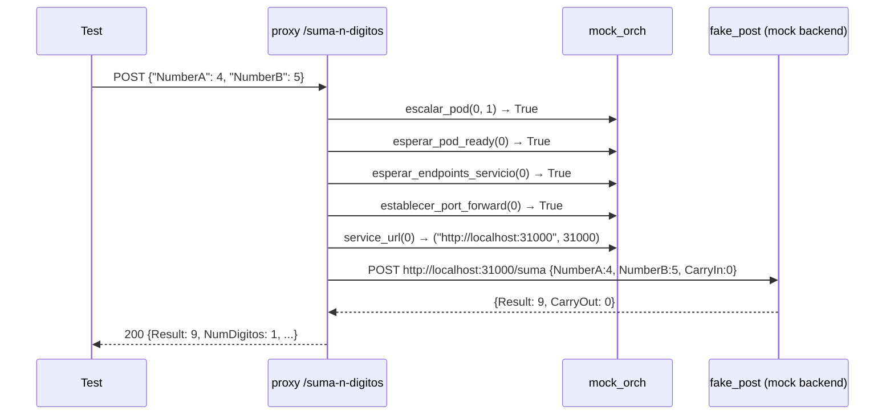
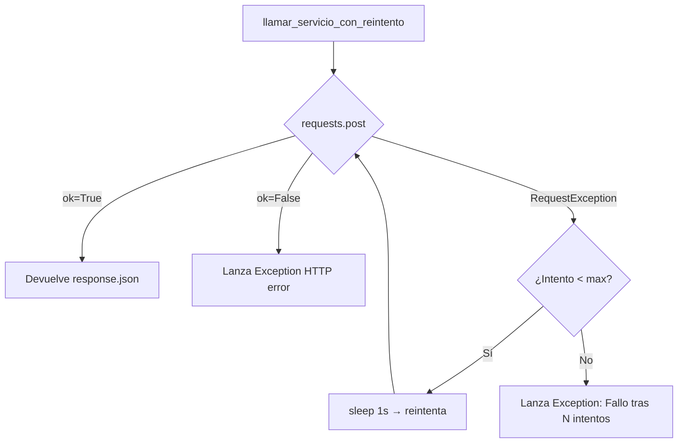

# Pruebas de Testing — SumaBasicaDocker

## Resumen ejecutivo

La suite de tests cubre los dos módulos Python principales de la aplicación: el proxy Flask (`proxy.py`) y el orquestador de Kubernetes (`k8s_orchestrator.py`). Se ejecuta automáticamente en el pipeline CI/CD de Azure DevOps como etapa obligatoria antes de construir la imagen Docker.

| Métrica | Valor |
|---|---|
| Total de tests | **63** |
| Tests pasando | **63 / 63** |
| Cobertura `proxy.py` | **85 %** |
| Cobertura `k8s_orchestrator.py` | **63 %** |
| Cobertura total | **76 %** |
| Umbral mínimo configurado | **70 %** |
| Framework | pytest 8.3.4 + pytest-cov 6.0.0 + pytest-mock 3.14.0 |
| Python | 3.13 |

---

## Estructura de archivos

```
tests/
├── __init__.py              # marca el directorio como paquete Python
├── conftest.py              # fixtures compartidos + estrategia de mocking
├── test_proxy.py            # 40 tests → proxy.py
└── test_orchestrator.py     # 23 tests → k8s_orchestrator.py
requirements-test.txt        # dependencias de testing
```

---

## Arquitectura de tests — `conftest.py`

### Problema a resolver

`proxy.py` instancia `K8sOrchestrator` en el ámbito de módulo al importarse:

```python
# proxy.py (línea ~65)
orchestrator = K8sOrchestrator(
    logger=registrar_terminal, ...
)
```

Si no se interviene antes del `import proxy`, el constructor intentaría conectarse a un clúster Kubernetes real, fallando en cualquier entorno CI.

### Estrategia: patch antes del import

```
conftest.py arranca → guarda clase REAL en _RealK8sOrchestrator
                    → parchea K8sOrchestrator con MagicMock
                    → importa proxy  ← proxy crea orchestrator mockeado
                                     ← no hay conexión real a K8s
```

```python
# 1. Guardar la clase REAL antes del parche (para test_orchestrator.py)
import k8s_orchestrator as _orch_module
_RealK8sOrchestrator = _orch_module.K8sOrchestrator

# 2. Configurar mock completo del orquestador
mock_orchestrator_instance = MagicMock()
mock_orchestrator_instance.escalar_pod.return_value = True
mock_orchestrator_instance.esperar_pod_ready.return_value = True
mock_orchestrator_instance.esperar_endpoints_servicio.return_value = True
mock_orchestrator_instance.establecer_port_forward.return_value = True
mock_orchestrator_instance.service_url.return_value = ("http://localhost:31000", 31000)

# 3. Activar el parche
_orch_patcher = patch("k8s_orchestrator.K8sOrchestrator", return_value=mock_orchestrator_instance)
_orch_patcher.start()

# 4. Ahora sí es seguro importar proxy
import proxy as proxy_module
```

### Fixtures disponibles

| Fixture | Scope | Descripción |
|---|---|---|
| `app` | `session` | Flask app con `TESTING=True` y `AUTO_SCALE_DOWN=False` |
| `client` | `function` | Flask test client (`app.test_client()`) |
| `mock_orch` | `function` | Devuelve el mock reseteado con valores por defecto |
| `RealOrchClass` | `function` | Devuelve `K8sOrchestrator` real (antes del parche) |

!!! note "¿Por qué `AUTO_SCALE_DOWN = False`?"
    La función `escalar_a_cero_en_background()` lanza un thread demonio al terminar cada suma.
    En tests eso generaría temporizadores y llamadas externas asíncronas. Desactivarlo garantiza
    ejecución determinista.

---

## Tests de `proxy.py`

### `TestGetDigitos` — 7 tests

Valida la función pura `get_digitos(numero)` que descompone un entero en lista de dígitos de derecha a izquierda.

| Test | Entrada | Esperado | Qué verifica |
|---|---|---|---|
| `test_cero` | `0` | `[0]` | Caso borde: cero devuelve lista con un elemento |
| `test_un_digito` | `7` | `[7]` | Número de un solo dígito |
| `test_dos_digitos` | `56` | `[6, 5]` | Orden correcto: unidades primero |
| `test_cuatro_digitos` | `1234` | `[4, 3, 2, 1]` | Extracción de 4 dígitos |
| `test_numero_con_cero_intermedio` | `1007` | `[7, 0, 0, 1]` | Ceros intermedios no se omiten |
| `test_maximo_soportado` | `9999` | `[9, 9, 9, 9]` | Máximo del sistema (4 dígitos) |
| `test_potencia_de_10` | `100` | `[0, 0, 1]` | Ceros significativos al inicio del número |

---

### `TestNormalizarDigitos` — 4 tests

Valida `normalizar_digitos(digitos_a, digitos_b)` que iguala longitudes rellenando con ceros por la derecha.

| Test | `A` | `B` | `A` esperado | `B` esperado | Qué verifica |
|---|---|---|---|---|---|
| `test_misma_longitud` | `[1, 2]` | `[3, 4]` | `[1, 2]` | `[3, 4]` | Sin cambios cuando son iguales |
| `test_a_mas_corto` | `[5]` | `[3, 4]` | `[5, 0]` | `[3, 4]` | Rellena A con cero |
| `test_b_mas_corto` | `[1, 2, 3]` | `[9]` | `[1, 2, 3]` | `[9, 0, 0]` | Rellena B con dos ceros |
| `test_ambos_vacios` | `[]` | `[]` | `[]` | `[]` | Listas vacías no causan error |

---

### `TestGetNombrePosicion` — 5 tests (parametrizado)

Valida `get_nombre_posicion(pos)` que mapea índice de posición a su nombre semántico.

| Posición | Nombre esperado |
|---|---|
| `0` | `"Unidades"` |
| `1` | `"Decenas"` |
| `2` | `"Centenas"` |
| `3` | `"Millares"` |
| `5` (fuera de rango) | `"Posicion-5"` |

---

### `TestSumaNDigitosValidaciones` — 5 tests

Valida las reglas de negocio del endpoint `POST /suma-n-digitos` sin llegar al backend K8s.

| Test | Payload | HTTP esperado | Qué verifica |
|---|---|---|---|
| `test_numero_negativo_a` | `NumberA: -1, NumberB: 0` | `400` | Rechazo de negativos |
| `test_numero_negativo_b` | `NumberA: 0, NumberB: -5` | `400` | Rechazo de negativos (campo B) |
| `test_numero_mayor_que_maximo` | `NumberA: 10000, NumberB: 0` | `400` | Límite superior (max=9999) |
| `test_ambos_en_limite_superior` | `NumberA: 9999, NumberB: 9999` | `≠ 400` | Límite superior válido no es error de validación |
| `test_options_cors` | `OPTIONS /suma-n-digitos` | `200` + `Access-Control-Allow-Origin` | Preflight CORS respondido correctamente |

---

### `TestSumaNDigitosHappyPath` — 7 tests

Tests del flujo completo de suma con mock del backend HTTP de los pods.

Los tests usan `_mock_backend(responses)`, un helper que genera una función `fake_post` que devuelve las respuestas configuradas en orden, simulando los microservicios de suma de dígitos sin necesidad de un clúster real.



| Test | Operación | Resultado esperado | Qué verifica |
|---|---|---|---|
| `test_suma_un_digito` | `4 + 5` | `Result=9, NumDigitos=1` | Suma de un solo dígito, campo `ContenedoresUsados` |
| `test_suma_dos_digitos_sin_carry` | `13 + 38` | `NumDigitos=2` | Orquestación de 2 pods, 2 llamadas HTTP |
| `test_suma_cuatro_digitos` | `1234 + 5678` | `Result=6912, NumDigitos=4, len(Details)=4` | Suma completa de 4 dígitos con carry |
| `test_suma_cero_mas_cero` | `0 + 0` | `Result=0` | Caso borde: ambos operandos cero |
| `test_response_contiene_details` | `2 + 3` | `Details[0].NombrePosicion=="Unidades"`, `EventosEscalado` presente | Estructura del JSON de respuesta |
| `test_error_backend_devuelve_500` | `1 + 2` (backend falla) | `500` | Propagación de errores del microservicio |
| `test_fallo_escalar_pod_devuelve_500` | `1 + 2` (escalar falla) | `500` | Propagación de fallo de orquestación |

---

### `TestTerminalStream` — 1 test

| Test | Método | Qué verifica |
|---|---|---|
| `test_content_type_sse` | `GET /terminal-stream` | `Content-Type: text/event-stream`, header `Cache-Control: no-cache` |

El test abre la conexión SSE sin consumir el cuerpo (streaming infinito) y solo valida las cabeceras HTTP.

---

### `TestTerminalClear` — 1 test

| Test | Método | Qué verifica |
|---|---|---|
| `test_limpia_buffer` | `POST /terminal-clear` | Responde `{"ok": true}`, el buffer `terminal_log_buffer` queda vacío |

El test añade previamente una entrada al buffer mediante `registrar_terminal()` y verifica que el endpoint realmente lo vacía.

---

### `TestDocsUrl` — 3 tests

Valida el endpoint `GET /docs-url` que lanza `kubectl get svc suma-docs` para obtener la IP pública de la documentación.

| Test | Simulación | `status` esperado | Qué verifica |
|---|---|---|---|
| `test_devuelve_ip_cuando_disponible` | `kubectl` devuelve `"10.0.0.5"` | `"ok"`, `url: "http://10.0.0.5"` | IP disponible → URL formada correctamente |
| `test_devuelve_pending_cuando_sin_ip` | `kubectl` devuelve `""` | `"pending"`, `url: null` | Sin IP → estado pendiente |
| `test_devuelve_error_si_subprocess_falla` | `subprocess.run` lanza excepción | `"error"`, `url: null` | kubectl no encontrado / timeout |

---

### `TestGrafanaUrl` — 3 tests

Valida el endpoint `GET /grafana-url` que consulta el servicio `kube-prometheus-stack-grafana` en el namespace `monitoring`.

| Test | Simulación | `status` esperado | Qué verifica |
|---|---|---|---|
| `test_devuelve_ip_cuando_disponible` | stdout `"20.30.40.50"` | `"ok"`, `url: "http://20.30.40.50"` | IP disponible |
| `test_devuelve_pending_cuando_sin_ip` | stdout `"  "` (solo espacios) | `"pending"` | `.strip()` aplicado correctamente |
| `test_devuelve_error_si_exception` | `TimeoutError` lanzado | `"error"` | Excepción capturada |

---

### `TestLlamarServicioConReintento` — 4 tests

Valida la función `llamar_servicio_con_reintento(url, payload, digito, intentos)` que realiza hasta N intentos HTTP hacia un pod de suma.



| Test | Escenario | Qué verifica |
|---|---|---|
| `test_exito_primer_intento` | Backend responde OK al primer intento | Devuelve el JSON correcto sin reintentar |
| `test_reintenta_y_falla_lanza_excepcion` | Todos los intentos fallan | Lanza `Exception` con mensaje `"Fallo comunicando"` |
| `test_exito_en_segundo_intento` | Primer intento falla, segundo OK | Reintento exitoso, `call_count == 2` |
| `test_respuesta_http_error_lanza_excepcion` | Backend responde `503 Service Unavailable` | `response.ok = False` dispara excepción |

Los tests parchean `proxy.time.sleep` para que los delays de reintento no ralenticen la suite.

---

## Tests de `k8s_orchestrator.py`

A diferencia de los tests de proxy, aquí se usan instancias **reales** de `K8sOrchestrator` (accedidas vía fixture `RealOrchClass`), parcheando únicamente las llamadas al sistema operativo (`subprocess.run`, `subprocess.Popen`, `socket.socket`, `time.sleep`).

### `TestServiceUrl` — 4 tests

Valida `service_url(digito)` que devuelve la URL y puerto para contactar a un pod.

| Test | Configuración | URL esperada | Puerto |
|---|---|---|---|
| `test_modo_local_sin_portforward_registrado` | `in_cluster=False`, sin port-forward activo | `http://localhost:31000` | `31000` |
| `test_modo_local_con_portforward_registrado` | `in_cluster=False`, `port_forward_ports[2] = 31099` | `http://localhost:31099` | `31099` |
| `test_modo_in_cluster_digito_0` | `in_cluster=True` | `http://suma-digito-0.calculadora-suma.svc.cluster.local:8000` | `8000` |
| `test_modo_in_cluster_digito_3` | `in_cluster=True` | `http://suma-digito-3.calculadora-suma.svc.cluster.local:8000` | — |

**Lógica de negocio verificada:** en modo local usa `base_port + digito` como fallback cuando no hay port-forward activo; en modo in-cluster construye el FQDN del Service de Kubernetes.

---

### `TestEscalarPod` — 6 tests

Valida `escalar_pod(digito, replicas)` que ejecuta `kubectl scale deployment`.

| Test | Simulación de `subprocess.run` | Resultado esperado | Qué verifica |
|---|---|---|---|
| `test_escala_exitosamente` | `returncode=0` | `True` | Éxito + logger fue llamado |
| `test_escala_a_cero` | `returncode=0` | `True` | Scale-to-zero es operación válida |
| `test_retorna_false_si_kubectl_falla` | `returncode=1, stderr="deployment not found"` | `False` | Código de salida ≠ 0 → False |
| `test_retorna_false_si_timeout` | `TimeoutExpired` | `False` | Timeout de subprocess manejado |
| `test_retorna_false_si_excepcion` | `OSError("kubectl not found")` | `False` | Excepción genérica manejada |
| `test_nombre_deployment_correcto` | captura el comando real | `"suma-digito-2"` en cmd, `"--replicas=1"`, `"-n"`, `"calculadora-suma"` | El comando kubectl construido es correcto |

---

### `TestEsperarPodReady` — 5 tests

Valida `esperar_pod_ready(digito, timeout)` que ejecuta `kubectl wait --for=condition=ready`.

| Test | Simulación | Resultado | Qué verifica |
|---|---|---|---|
| `test_pod_listo` | `returncode=0` | `True` | Pod Ready en tiempo |
| `test_pod_no_listo` | `returncode=1` | `False` | Condition no alcanzada → False |
| `test_timeout_subprocess` | `TimeoutExpired` | `False` | Timeout de subprocess manejado |
| `test_excepcion_genérica` | `RuntimeError("unexpected")` | `False` | Excepción inesperada no propagada |
| `test_label_digito_en_comando` | captura el comando | `"digito=3"` en algún argumento | Label selector correcto en el comando kubectl |

---

### `TestObtenerPuertoLocalDisponible` — 2 tests

Valida `obtener_puerto_local_disponible(puerto_preferido)` que usa `socket.bind` para probar disponibilidad.

| Test | Simulación de socket | Puerto esperado | Qué verifica |
|---|---|---|---|
| `test_puerto_preferido_libre` | `bind()` no lanza `OSError` | `31000` | Devuelve el puerto preferido cuando está libre |
| `test_puerto_preferido_ocupado_devuelve_alternativo` | 1er `bind()` → `OSError`, 2do `bind()` OK + `getsockname()→49999` | `49999` | Fallback a puerto dinámico cuando el preferido está ocupado |

**Flujo interno verificado:**

```
bind(31000) → OSError  →  nuevo socket bind(0)  →  getsockname() → puerto dinámico
```

---

### `TestDetenerPortForward` — 3 tests

Valida `detener_port_forward(digito)` que termina el proceso `kubectl port-forward`.

| Test | Estado inicial | Qué verifica |
|---|---|---|
| `test_sin_proceso_registrado_no_falla` | Sin entrada en `port_forward_processes` | No lanza excepción (idempotente) |
| `test_termina_proceso_activo` | Proceso con `poll()=None` (vivo) | `proc.terminate()` es llamado exactamente una vez; entradas eliminadas de los dicts |
| `test_limpia_proceso_ya_terminado` | Proceso con `poll()=0` (ya terminado) | Entradas eliminadas aunque el proceso ya había finalizado |

---

### `TestEstablecerPortForwardInCluster` — 1 test

| Test | Qué verifica |
|---|---|
| `test_retorna_true_sin_ejecutar_kubectl` | En modo `in_cluster=True`, devuelve `True` inmediatamente sin lanzar ningún `subprocess.Popen` |

---

### `TestEscalarACero` — 2 tests

Valida `escalar_a_cero(delay_seconds)` que escala los 4 pods a 0 réplicas con un delay opcional.

| Test | Qué verifica |
|---|---|
| `test_escala_todos_los_pods` | `escalar_pod` es llamado exactamente 4 veces, una por cada dígito (0, 1, 2, 3) con `replicas=0` |
| `test_respeta_delay` | `time.sleep(2)` es llamado cuando `delay_seconds=2` |

---

## Integración en el pipeline CI/CD

La etapa `Testing` se ejecuta en Azure DevOps entre `CodeQuality` y `BuildAndPush`:


### Configuración de la etapa

```yaml
- stage: Testing
  displayName: 'Unit & Integration Tests'
  dependsOn: CodeQuality
  jobs:
    - job: RunTests
      pool:
        vmImage: 'ubuntu-latest'
      steps:
        - script: |
            pip install -r requirements.txt -r requirements-test.txt
          displayName: 'Instalar dependencias'

        - script: |
            python -m pytest tests/ \
              --cov=proxy \
              --cov=k8s_orchestrator \
              --cov-report=xml:coverage.xml \
              --cov-fail-under=70 \
              --junit-xml=test-results.xml \
              -v
          displayName: 'Ejecutar tests con cobertura'

        - task: PublishTestResults@2
          inputs:
            testResultsFormat: 'JUnit'
            testResultsFiles: 'test-results.xml'

        - task: PublishCodeCoverageResults@2
          inputs:
            summaryFileLocation: 'coverage.xml'
```

### Artefactos publicados

| Artefacto | Formato | Uso |
|---|---|---|
| `test-results.xml` | JUnit | Visualización en Azure DevOps Tests tab |
| `coverage.xml` | Cobertura (XML) | Visualización en Azure DevOps Coverage tab |

!!! warning "Fallo de cobertura"
    Si la cobertura total cae por debajo del **70 %**, el flag `--cov-fail-under=70` hace que
    pytest salga con código `2`, lo que marca la etapa como fallida y **bloquea el build de la imagen**.

---

## Dependencias de testing

`requirements-test.txt`:

```
pytest==8.3.4
pytest-cov==6.0.0
pytest-mock==3.14.0
```

Estas dependencias se instalan **adicionalmente** a `requirements.txt` (dependencias de producción).
Se mantienen separadas para no incluirlas en la imagen Docker.

---

## Cobertura por módulo

```
Name                  Stmts   Miss  Cover   Missing
---------------------------------------------------
k8s_orchestrator.py     149     55    63%   84-141, 152-203, 215-216, 218-219, 244
proxy.py                231     35    85%   31, 107-113, 117, 130, 135-137, 140-141,
                                            195-197, 251, 290, 294, 301, 355, 377,
                                            409-424
---------------------------------------------------
TOTAL                   380     90    76%
```

### Líneas no cubiertas

**`proxy.py` (15% sin cubrir):**

- Línea 31: handler SIGTERM
- Líneas 107–117: ruta `serve_static` (archivos estáticos)
- Líneas 130–141: logs de inicio de servidor
- Líneas 195–197: hilo de scale-down background (desactivado en tests)
- Líneas 409–424: bloque `if __name__ == '__main__'`

**`k8s_orchestrator.py` (37% sin cubrir):**

- Líneas 84–141: `esperar_endpoints_servicio()` (lógica compleja con polling y múltiples comandos kubectl)
- Líneas 152–203: `establecer_port_forward()` en modo local (requiere `subprocess.Popen`)
- Líneas 215–219: ramas de error dentro de `establecer_port_forward`
- Línea 244: rama `if not self.in_cluster` en `escalar_a_cero`

---

## Ejecución local

```bash
# Instalar dependencias de test
pip install -r requirements.txt -r requirements-test.txt

# Ejecutar todos los tests con cobertura
python -m pytest tests/ --cov=proxy --cov=k8s_orchestrator --cov-report=term-missing -v

# Ejecutar solo los tests de proxy
python -m pytest tests/test_proxy.py -v

# Ejecutar solo los tests del orquestador
python -m pytest tests/test_orchestrator.py -v

# Ejecutar un test específico
python -m pytest tests/test_proxy.py::TestSumaNDigitosHappyPath::test_suma_cuatro_digitos -v
```
